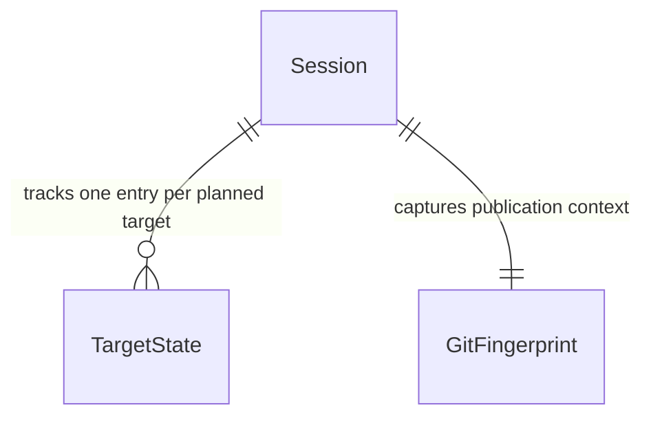

# Sessões persistentes do `prt desc`

Sources:

- [Issue #11](https://github.com/nitoba/pr-tools/issues/11) - escopo funcional, estados mínimos, revalidação Git, recovery de criação incerta, segurança e critérios de aceitação.
- `apps/rust/src/tui/live.rs` - estado vivo, publicação multi-target, callbacks por target e telas de recovery existentes.
- `apps/rust/src/tui/describe_app.rs` - máquina de fases, conteúdo aprovado congelado, PRs confirmados e seleção de candidatos.
- `apps/rust/src/features/describe.rs` - `DescribePrep`, `PublishFailureKind` e lookup de candidatos reutilizável.
- `apps/rust/src/git/mod.rs` - `GitContextFingerprint` para identificar o checkout e as refs observadas.
- `apps/rust/src/azure/pull_requests.rs` - `PublishedPr`, criação multi-target e busca de candidatos no Azure DevOps.

## Problem

Hoje o contexto de revisão e publicação do `prt desc` existe somente na execução atual da TUI. Se o usuário fecha o terminal, encerra o processo ou reinicia a máquina depois de gerar a descrição ou durante uma publicação multi-target, título, corpo, reviewers e progresso por target deixam de estar disponíveis. O custo é reconstruir manualmente a revisão e aumenta o risco de repetir uma criação remota cujo resultado já pode existir no Azure DevOps.

A issue não fornece métricas de volume ou urgência; a evidência é comportamental e está descrita literalmente nos fluxos de falha parcial e resposta perdida. Quando esta mudança estiver disponível, o usuário poderá fechar uma revisão explicitamente, reabrir uma sessão pelo identificador, continuar somente os targets não confirmados e tratar um resultado remoto incerto antes de reenviar.

## Out of scope

| Excluded | Why |
| --- | --- |
| Sincronização de sessões entre máquinas | A issue exige armazenamento local; cloud e compartilhamento remoto ficam fora da V1. |
| Colaboração multiusuário ou edição concorrente da mesma sessão | O fluxo é local e de usuário único; a V1 apenas detecta uma segunda abertura e preserva o arquivo. |
| Retomada do fluxo `prt test` | A primeira versão é restrita ao fluxo `prt desc`. |
| Atualização automática do conteúdo com novos commits | Conteúdo obsoleto exige confirmação explícita; regeneração automática não é parte da retomada. |
| Execução em background | A sessão é durável entre execuções, mas a publicação continua pertencendo a uma execução interativa. |
| Garantia distribuída de exactly-once remoto | O Azure DevOps não fornece essa garantia para este fluxo; a V1 reconcilia e exige decisão explícita. |
| Histórico completo de versões da descrição | A sessão mantém somente o último snapshot necessário para retomar; revisões anteriores não são produto. |
| Sessões para `prt test`, `prt update` ou outros comandos | Evita ampliar o contrato persistente além do fluxo descrito na issue. |

## Assumptions

| Assumption | Chosen default | Rationale | Confirmed? |
| --- | --- | --- | --- |
| Como o usuário inicia uma retomada | `prt desc --resume` abre um seletor local; `prt desc --session <uuid>` abre uma sessão exata. Nenhuma sessão antiga é carregada automaticamente. | A issue pede identificação não ambígua e explicitamente rejeita carregar rascunho antigo sem informar o usuário; reutilizar `desc` evita um novo comando top-level. | n |
| Como uma revisão é salva | A sessão é criada automaticamente quando a descrição validada entra em `Review`; edições, reviewers e progresso são persistidos automaticamente, e a saída aguarda o flush local. Não haverá uma etapa obrigatória de “salvar” separada. | A criação automática cobre encerramento inesperado e preserva o fluxo atual; o usuário ainda pode revisar e sair sem perder o conteúdo. | n |
| Identidade do usuário ao retomar | A sessão restaura reviewers aprovados e conteúdo; o PAT e demais credenciais são carregados da configuração atual somente quando uma operação Azure for necessária. | Cumpre a regra de não persistir segredos e permite corrigir credenciais expiradas sem regravar o rascunho. | n |
| Revalidação do contexto Git | Repositório ou branch source diferentes bloqueiam publicação; alteração ou ausência de qualquer OID source/target permite leitura/edição, mas exige uma nova confirmação explícita antes de publicar. O fingerprint original não é sobrescrito pela confirmação. | A mudança de commits pode não impedir leitura, mas nunca deve autorizar publicação silenciosa de conteúdo potencialmente obsoleto. | n |
| Semântica de `failed` | `failed` significa erro comprovadamente anterior à criação, seguindo `PublishFailureKind::Confirmed`; transporte, timeout, HTTP 408/429/5xx e payload 2xx inválido continuam `uncertain`. | Reutiliza a classificação já existente e evita transformar ausência de confirmação em “não criado”. | y |
| Encerramento da sessão | Quando todos os targets estão `confirmed`, a sessão é removida depois da saída bem-sucedida da TUI; uma sessão incompleta permanece. O usuário também poderá confirmar `d`/“descartar sessão” em uma revisão. | Mantém o diretório livre de sessões resolvidas e oferece uma saída explícita para abandonar um rascunho. | n |
| Concorrência local | Uma sessão aberta adquire lock exclusivo; outra execução recebe erro local antes de escrever ou chamar o Azure. O lock de arquivo é liberado pelo sistema operacional quando o processo termina. | Evita last-writer-wins e permite retomar após encerramento abrupto sem depender de lock stale manual. | n |
| Perfil de verificação | `light`, por ser o perfil padrão na ausência de declaração em `AGENTS.md`. | O perfil é a linha de base da skill; pode ser elevado para `standard` antes dos checks se a revisão exigir fault injection e recomputação de cobertura. | n |

**Open questions:** none - all unresolved product choices are recorded above with a chosen default.

## Criteria

Grouped by slice - one observable outcome each, never a layer. Numbering runs across the whole plan.

### S1: salvar, identificar e retomar uma revisão (P1)

**Acceptance Criteria**

1. WHEN uma descrição `PrDescription` validada entra na fase `Review`, THEN o sistema SHALL criar uma sessão com UUID v4 não vazio e persistir título, corpo, reviewers, Work Item resolvido, targets planejados, identidade remota, branch source, fingerprint Git e timestamps antes de permitir que a TUI seja encerrada.
2. WHILE uma sessão estiver na fase `Review`, o sistema SHALL exibir o identificador da sessão e uma linha por target com um dos estados `pendente`, `resultado incerto`, `confirmado` ou `falhou`.
3. WHEN o usuário sair de uma revisão ou de um diálogo depois de uma edição de conteúdo/reviewer, THEN o sistema SHALL aguardar a conclusão do snapshot local mais recente antes de retornar o controle ao comando.
4. WHEN `prt desc --resume` iniciar a enumeração, THEN o sistema SHALL exibir o estado de carregamento local até a varredura do diretório de sessões terminar, sem chamar provider de IA nem `POST` no Azure DevOps.
5. IF `prt desc --resume` não encontrar sessões válidas, THEN o sistema SHALL exibir o estado vazio “nenhuma sessão retomável” e terminar sem chamada de provider ou `POST` remoto.
6. WHEN `prt desc --resume` encontrar uma ou mais sessões válidas, THEN o sistema SHALL exibir uma linha por sessão com UUID, repositório, branch source, `updated_at` e resumo dos estados dos targets, ordenada por `updated_at` decrescente e, em empate, por UUID crescente.
7. WHEN o usuário selecionar uma linha do seletor ou informar `prt desc --session <uuid>`, THEN o sistema SHALL restaurar exatamente o último título, corpo, reviewers, targets planejados, Work Item e estados por target sem executar geração via provider.
8. IF `--session <uuid>` não existir, não for um UUID v4 válido, estiver corrompido ou for incompatível com o schema, THEN o sistema SHALL exibir erro local, retornar exit code `1` ou `2` conforme erro de sessão ou argumento, e emitir zero chamadas remotas.
9. IF `--resume` ou `--session` for combinado com `--source`, `--target`, `--work-item`, `--provider`, `--model`, `--base-url`, `--api-key`, `--create`, `--no-create`, `--raw` ou `--dry-run`, THEN o sistema SHALL rejeitar os argumentos com exit code `2` antes de carregar ou alterar uma sessão.
10. WHEN o usuário confirmar `d`/“descartar sessão”, THEN o sistema SHALL remover todos os snapshots e o lock dessa sessão e emitir zero chamadas remotas.

**Independent test:** gerar uma descrição com dois targets, encerrar na revisão, executar `prt desc --resume`, selecionar a sessão e comparar o conteúdo, reviewers, targets e estados restaurados; repetir com diretório vazio, UUID inexistente e arquivo corrompido.

### S2: persistir e continuar publicação multi-target (P1)

**Acceptance Criteria**

11. WHILE um target ainda não tiver tentativa remota, o sistema SHALL persistir o estado `pending` sem ID ou URL de PR.
12. WHEN a publicação iniciar um target, THEN o sistema SHALL persistir `uncertain` de forma durável antes de enviar o `POST` de criação daquele target.
13. WHEN o Azure DevOps retornar um payload válido de PR criado, THEN o sistema SHALL persistir `confirmed` com ID positivo e URL navegável antes de iniciar o próximo target ou anunciar conclusão.
14. IF a publicação falhar com `PublishFailureKind::Confirmed`, THEN o sistema SHALL persistir `failed` no target ativo e conservar os targets ainda não iniciados como `pending`.
15. IF ocorrer falha de transporte, timeout, HTTP `408`, `429`, qualquer HTTP `5xx` ou resposta `2xx` sem payload válido, THEN o sistema SHALL conservar o target como `uncertain` e não executar um novo `POST` automaticamente.
16. WHEN uma sessão retomada tiver target `confirmed`, THEN o sistema SHALL exibir o ID/URL persistidos e excluir esse target de qualquer nova chamada de criação.
17. WHEN uma sessão retomada tiver target `uncertain`, THEN o sistema SHALL exibir “resultado incerto” e exigir lookup de candidatos ou confirmação explícita de retry antes de qualquer novo `POST` desse target.
18. WHEN o lookup de candidatos retornar um PR compatível e o usuário o adotar explicitamente, THEN o sistema SHALL persistir o target como `confirmed` com o ID/URL adotados sem enviar `POST` de criação.
19. IF o lookup de candidatos retornar zero resultados, THEN o sistema SHALL informar que a ausência não prova que nenhum PR foi criado e exigir uma confirmação explícita de retry antes de criar.
20. WHEN o processo terminar depois de confirmar um target e antes de resolver os demais, THEN a próxima retomada SHALL exibir o target confirmado com seu ID/URL e manter cada target restante em `pending` ou `uncertain` conforme o último snapshot durável.
21. IF o snapshot `uncertain` não puder ser persistido antes do `POST`, THEN o sistema SHALL manter o snapshot anterior, exibir erro de persistência e não emitir o `POST` remoto.
22. IF a confirmação `confirmed` não puder ser persistida depois de um `POST` bem-sucedido, THEN o sistema SHALL tratar o target como `uncertain` na próxima retomada e não emitir retry automático.

**Independent test:** usar um Azure fake que registre cada request e falhe em pontos controlados; provar a ordem `persist uncertain -> POST -> persist confirmed`, a preservação de `pending`, a retomada sem duplicar target confirmado e a adoção de candidato sem POST.

### S3: revalidar contexto Git antes de publicar (P1)

**Acceptance Criteria**

23. WHEN a raiz do repositório atual ou a branch source atual diferir do fingerprint salvo, THEN o sistema SHALL permitir leitura/edição do conteúdo salvo, exibir erro de contexto divergente e bloquear toda publicação dessa sessão.
24. IF algum OID source ou target salvo diferir do OID atual, ou a ref atual não puder ser resolvida, THEN o sistema SHALL permitir leitura/edição, exibir aviso de conteúdo potencialmente obsoleto e exigir confirmação explícita antes de publicar.
25. WHEN raiz, branch source, OID source e todos os OIDs dos targets forem iguais aos salvos, THEN o sistema SHALL abrir a revisão sem confirmação adicional de contexto Git.
26. IF o fingerprint não puder ser capturado durante a retomada, THEN o sistema SHALL bloquear publicação, exibir erro local acionável e emitir zero chamadas remotas.

**Independent test:** salvar uma sessão em um repositório/branch/SHAs conhecidos, retomar com cada variação isolada e verificar que somente a igualdade completa libera publicação silenciosa; verificar que a confirmação de contexto divergente libera apenas aquela execução.

### S4: schema, durabilidade e isolamento de segredos (P1)

**Acceptance Criteria**

27. The system SHALL serialize each session using schema version `1`, UUID v4, timestamps UTC RFC 3339, the allowlisted resume data and the four target-state values `pending`, `uncertain`, `confirmed` and `failed`.
28. The system SHALL omit `Config`, PAT, API key, token temporário, prompt, diff, log e qualquer valor de credencial do JSON persistido.
29. IF um snapshot JSON for malformado ou tiver `schemaVersion` diferente de `1`, THEN o sistema SHALL reportar erro seguro, não sobrescrever o snapshot e emitir zero chamadas remotas.
30. IF o processo for interrompido durante uma gravação, THEN o sistema SHALL deixar o último snapshot durável anterior carregável e ignorar qualquer arquivo temporário incompleto na próxima enumeração.
31. IF outra execução já mantiver o lock exclusivo da sessão, THEN o sistema SHALL retornar erro de concorrência antes de escrever o snapshot, publicar ou excluir a sessão.
32. WHEN uma sessão chegar a `confirmed` em todos os targets e a TUI sair com sucesso, THEN o sistema SHALL remover seus snapshots persistidos e não mostrar a sessão como retomável em uma enumeração posterior.

**Independent test:** inspecionar o JSON serializado por chaves e valores proibidos, injetar JSON inválido/schema desconhecido, interromper gravação antes do rename e abrir a mesma sessão em duas execuções concorrentes.

## Traceability

| ID | Slice | Criteria | Status |
| --- | --- | --- | --- |
| SESSION-01 | S1 | 1-10 | Pending |
| PUBLISH-01 | S2 | 11-22 | Pending |
| GIT-01 | S3 | 23-26 | Pending |
| STORAGE-01 | S4 | 27-32 | Pending |

**ID format:** `CATEGORY-NUMBER`. **Status:** Pending → In checks → Implementing → Verified.

## Observable

| Surface | Decision | Landing |
| --- | --- | --- |
| screen `prt desc --resume` | loading state | AC 4 |
| screen `prt desc --resume` | empty state | AC 5 |
| screen `prt desc --resume` | populated ordering and duplicate-free identity | AC 6 |
| screen `prt desc --resume` | local read/schema error state | AC 8, AC 29 |
| screen `prt desc --session <uuid>` | not-found/invalid selector error | AC 8 |
| screen `prt desc` review | saved content and session identity | AC 1, AC 2, AC 3 |
| screen `prt desc` review/publication | target ordering and states | AC 2, AC 11, AC 16, AC 20 |
| screen `prt desc` review/publication | repository/branch mismatch error | AC 23 |
| screen `prt desc` review/publication | stale OID warning and confirmation | AC 24, AC 25 |
| screen `prt desc` recovery | uncertain result, candidate lookup and explicit retry | AC 17, AC 18, AC 19 |
| screen `prt desc` review | destructive discard confirmation | AC 10 |
| screen `prt desc` publication | remote authorization/transport/partial-failure error | AC 14, AC 15, AC 21, AC 22 |
| command `prt desc --resume` | flags, output and process result | AC 4, AC 5, AC 6, AC 8, AC 9; status `200` (exit 0), `400` (exit 2), `500` (exit 1), `130` (cancelled) |
| command `prt desc --session <uuid>` | exact selector and process result | AC 7, AC 8, AC 9; status `200` (exit 0), `400` (exit 2), `500` (exit 1), `130` (cancelled) |

The `200`/`400`/`500` labels above enumerate success, argument/selection failure and local/runtime failure; the actual CLI contract is the process exit code in parentheses.

## Flow

The feature reuses the existing `DescribePrep`, `GitContextFingerprint`, `DescribeApp` state machine, candidate lookup and Azure publisher. It adds one persistence boundary rather than serializing the runtime/TUI objects.

1. `prt desc` entra em `main.rs` (exists), usa `features::describe::prepare` (exists) e o backend de geração em `tui::live` (exists), que produz uma `PrDescription` validada.
2. A transição para `Review` em `tui::live` (exists) cria e atualiza o DTO em `features::session` (door 1); o writer grava o snapshot durável e entrega o identificador à TUI.
3. `prt desc --resume` em `main.rs` (exists) chama `features::session` (door 1) para enumerar, selecionar e carregar o último snapshot; o conteúdo segue diretamente para `tui::live` (exists), sem atravessar provider de IA.
4. A retomada compara o snapshot com `git::GitContextFingerprint` (exists). Divergência de repositório/branch bloqueia; divergência de OID pede confirmação. Um target `uncertain` usa `features::describe::find_publish_candidates` (exists), que reutiliza lookup em `azure::pull_requests` (exists).
5. Para cada target, `tui::live` (exists) ordena `features::session` (door 1) persistir `uncertain` e aguardar o flush; só então `azure::pull_requests` (exists) chama o Azure. O receipt confirmado ou a falha classificada volta pelo evento existente e gera novo snapshot antes do próximo target.
6. Ao adotar candidato, concluir todos os targets ou confirmar descarte, `features::session` (door 1) remove os snapshots/lock quando aplicável; a TUI entrega a receipt existente ou o erro existente ao comando.

## Relations

One-way constraints: um `Session` tem um identificador UUID v4 único no diretório local; cada target planejado aparece uma única vez dentro da sessão; `TargetState` usa somente `pending`, `uncertain`, `confirmed` ou `failed`; `confirmed` guarda um receipt remoto e não volta para `pending`.

## Surface

| Route | In | Out | Status |
| --- | --- | --- | --- |
| `prt desc` | checkout Git e flags atuais | TUI de geração/revisão/publicação com sessão local | `200` (exit 0), `500` (exit 1), `130` (cancelled) |
| `prt desc --resume` | nenhum argumento de sessão; sessão local opcional | seletor e TUI de retomada | `200` (exit 0), `400` (exit 2), `500` (exit 1), `130` (cancelled) |
| `prt desc --session <uuid>` | UUID v4 exato | TUI da sessão selecionada | `200` (exit 0), `400` (exit 2), `500` (exit 1), `130` (cancelled) |

## Landing

| One-way door | Literal shape | Alternative rejected |
| --- | --- | --- |
| Identidade e localização da sessão | UUID v4 canônico; snapshots em `config_paths().directory/sessions/session-<uuid>-<revision>.json`; lock em `session-<uuid>.lock`; nenhum arquivo no repositório. | Timestamp/PID ou nome derivado do branch, rejeitado porque pode colidir e não oferece identidade estável e não ambígua para `--session`. |
| DTO persistido e evolução | JSON com `schemaVersion: 1`, revisão monotônica, timestamps UTC RFC 3339, contexto Git/remote, conteúdo aprovado, Work Item, reviewers, targets e estado por target; `deny_unknown_fields` no schema V1. | Serializar `DescribeApp`, `DescribePrep` ou `Config`, rejeitado porque acopla o formato à TUI e pode incluir prompt, diff, logs ou segredos; schema sem versão não permite erro seguro em futuras mudanças. |
| Estados de publicação | Enum literal `pending -> uncertain -> confirmed | failed`; retry explícito de `failed` volta a `uncertain`; adoção explícita de candidato vai para `confirmed`; nenhum POST automático parte de `uncertain`. | Booleano `published`, rejeitado porque não distingue tentativa não enviada, falha comprovada e resposta perdida, permitindo duplicação remota. |
| Durabilidade local | Cada gravação cria um arquivo temporário no mesmo diretório, faz `flush`/`sync_all` e renomeia para um novo revisionado; enumeração escolhe a maior revisão e ignora `.tmp`; snapshots antigos são removidos somente depois que o novo está durável. | Sobrescrever o JSON diretamente, rejeitado porque uma interrupção pode deixar o único snapshot ilegível; banco SQLite, rejeitado porque adiciona migração, lock e dependência sem necessidade para um único agregado local. |
| Concorrência | Lock exclusivo de arquivo obtido com `try_lock_exclusive` durante toda a retomada; conflito falha antes de qualquer escrita, delete ou request; o handle libera o lock no encerramento do processo. | Last-writer-wins ou lock lógico em JSON, rejeitados porque não protegem duas execuções que escrevem o mesmo snapshot e não são liberados de forma confiável após crash. |
| Interface de retomada | Flags `--resume` e `--session <uuid>` no subcomando existente `desc`; `--resume` lista, `--session` seleciona uma identidade exata; flags de geração entram em conflito. | Novo comando top-level `prt sessions`, rejeitado porque amplia a superfície de CLI e separa uma operação que pertence semanticamente ao fluxo `desc`. |

- Nothing else in this change is hard to reverse.

## Impact

| Front | What changes |
| --- | --- |
| domain | Novo termo `Session`: snapshot local retomável de uma revisão/publicação de `desc`; é consumido por `main.rs`, `tui::live` e a nova persistência. |
| domain | Novo termo `TargetState`: estado durável por target; `DescribeApp::published` e `PublishFailureKind::OutcomeUnknown` passam a ter representação entre processos, além da memória atual. |
| domain | `uncertain` significa “request pode ter sido enviado e o resultado não foi confirmado”; `tui::live`, `features::describe` e `azure::pull_requests` já ramificam sobre a distinção durante a execução e passarão a restaurá-la. |
| stored data | Novo diretório local `config_paths().directory/sessions`; não há dados existentes para backfill nem migração, e schema diferente de `1` é recusado. |
| CLI | `prt desc` ganha `--resume` e `--session <uuid>`; o seletor e o status da sessão passam a fazer parte da experiência interativa do comando. |
| TUI | Review, recovery e publicação exibem identidade da sessão, estados por target, divergência Git, estado vazio/erro e confirmação destrutiva; snapshots atuais de `desc` precisarão ser atualizados. |
| dependencies | `uuid` para identidade v4 e uma crate de lock de arquivo cross-platform tornam-se dependências diretas; a gravação permanece baseada em `serde_json` e filesystem existentes. |
| security | O serializer deixa de ter acesso estrutural a `Config`; PAT/API keys continuam somente em memória e são recarregados da configuração atual durante operações remotas. |
