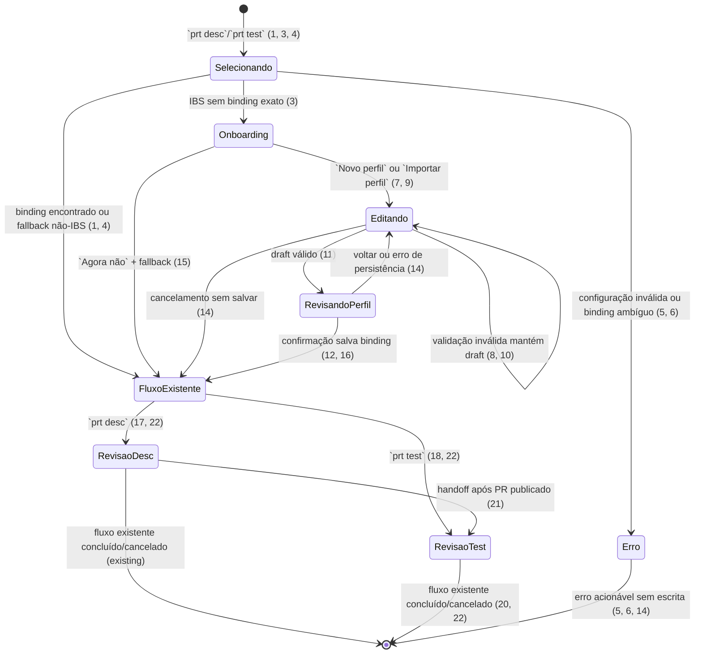
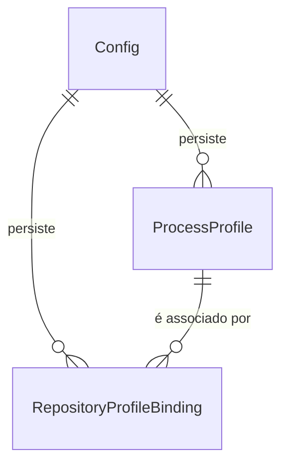

# Onboarding de perfis IBS por remote Azure

> Implemente com **tlc-implement** (`.agents/skills/tlc-implement/SKILL.md`).
> Cada critério abaixo torna-se uma checagem com prova, referenciada pelo seu número. Nada em
> `Unresolved` deve ser decidido durante a implementação.

## Intent

Hoje o `prt` seleciona um perfil por binding existente ou cai no `defaultProfile`. Para um clone
novo dos repositórios Azure da organização `ibsbiosistemico`, isso pode aplicar silenciosamente o
processo de outro projeto; a pessoa precisa descobrir os valores corretos, editar a configuração
global ou executar o wizard separado. O custo informado é ter de digitar novamente os valores de
processo e revisar manualmente a configuração antes de conseguir gerar um PR ou Test Case.

Quando isto estiver disponível, ao iniciar `prt desc` ou `prt test` em um clone Azure da organização
`ibsbiosistemico` sem binding para o remote exato, a pessoa verá uma sugestão de criar o perfil do
repositório. Poderá criar um perfil novo ou importar os valores de um perfil existente, alterar
somente os campos desejados, revisar e salvar. O comando então continuará a geração usando o perfil
recém-associado; perfis e bindings de outras organizações e o fallback atual continuam funcionando.

24 critérios em 3 slices · 7 decisões de mão única · 1 aberta, nenhuma bloqueia

## Criteria

### Detecção e decisão do perfil

1. Dado um `prt desc` ou `prt test` interativo em um clone cujo `origin` seja um remote Azure parseável com `organization` igual a `ibsbiosistemico` ignorando diferença de maiúsculas/minúsculas, quando existir um único binding para `(organization, project, repository)`, então o fluxo seleciona exatamente o perfil desse binding, mostra seu `name` e `programField` e não abre o onboarding.
2. Dado o mesmo remote Azure clonado em dois diretórios locais diferentes, quando o perfil for resolvido, então os dois comandos selecionam o mesmo binding e nenhuma decisão usa o caminho local como chave.
3. Dado um remote Azure da organização `ibsbiosistemico` sem binding para a tupla exata `(organization, project, repository)`, quando `prt desc` ou `prt test` iniciar em terminal interativo, então antes da primeira chamada ao provider de IA ou de qualquer writer de PR/Test Case a tela mostra `organization/project/repository`, informa que não há perfil associado e oferece as ações `Novo perfil`, `Importar perfil` e `Agora não`.
4. Dado um remote Azure de outra organização sem binding, quando `prt desc` ou `prt test` iniciar, então o onboarding não aparece, nenhum arquivo de configuração é alterado e a seleção continua usando o fallback `defaultProfile` existente (ou `Agrotrace` quando o fallback estiver vazio).
5. Se a configuração contiver erro de perfil/binding, então o comando mostra o erro existente antes do onboarding, não salva perfil, não chama o provider e não inicia nenhum writer remoto.
6. Dada uma configuração com mais de um binding para o mesmo remote IBS, quando o onboarding for avaliado, então a execução falha identificando o remote e todos os perfis conflitantes, sem escolher um deles nem abrir a tela de criação.

### Criação, importação e persistência

7. Quando `Novo perfil` for escolhido, a tela de edição solicita os campos persistidos `name`, `programField`, `areaPath`, `assignedTo`, `inheritIterationPath`, `parentTransition`, `priority`, `program`, `reviewerDev`, `reviewerSprint` e `team`; `priority` começa em `2`, `inheritIterationPath` começa em `true` e os demais valores podem ser preenchidos ou editados pela pessoa.
8. Dado um draft com `name` vazio, `programField` vazio, `priority` não finita ou menor/igual a `0`, email não vazio inválido ou nome já existente, quando a pessoa tentar salvar, então a tela identifica o campo inválido, mantém o draft aberto e não altera `config.json` nem inicia a geração.
9. Quando `Importar perfil` for escolhido, então a lista mostra todos os perfis persistidos pelo nome, e selecionar um perfil copia para o novo draft exatamente `areaPath`, `assignedTo`, `inheritIterationPath`, `parentTransition`, `priority`, `program`, `programField`, `reviewerDev`, `reviewerSprint` e `team`; o `name` do novo perfil permanece editável e o perfil de origem não é alterado antes do salvamento.
10. Dado um draft importado, quando a pessoa editar somente um ou mais campos, então cada campo não editado permanece byte a byte igual ao valor copiado e o valor editado aparece no resumo final.
11. Antes de salvar um draft válido, a revisão mostra o remote exato do binding, se a origem foi `Novo perfil` ou um perfil importado, o nome final e todos os campos do perfil com seus valores finais, e exige uma confirmação explícita de salvamento.
12. Dado um draft válido confirmado, quando o salvamento terminar, então `config.json` contém um único `ProcessProfile` com `name` e `programField` informados, os campos serializados em `camelCase`, e um único `RepositoryProfileBinding` para `(organization, project, repository)` apontando para esse perfil; `defaultProfile` permanece inalterado e PAT/API key não aparecem no perfil.
13. Dado o perfil salvo para um remote IBS, quando o mesmo comando for executado novamente ou a execução continuar após o salvamento, então o binding já existente é encontrado, nenhum segundo perfil/binding é criado e o onboarding não é mostrado novamente para aquela tupla.
14. Se a confirmação for cancelada, o draft for inválido ou a persistência falhar, então o perfil/binding anterior permanece sem alteração, a tela mostra uma mensagem acionável sem segredo e nenhum provider ou writer remoto é iniciado.
15. Quando `Agora não` for escolhido no onboarding, então não há alteração em `config.json` e o comando continua uma única vez com o fallback de perfil que já seria selecionado pelo comportamento existente.

### Continuação da geração com o perfil salvo

16. Quando o salvamento do onboarding terminar com sucesso, então a tela de onboarding fecha e a mesma execução de `prt desc` ou `prt test` retoma o fluxo original uma única vez, preservando os argumentos, targets, Work Item/PR e demais overrides já recebidos, sem voltar a pedir a criação do perfil.
17. Dado `prt desc` continuando com um perfil recém-salvo, quando a revisão de publicação for exibida, então ela mostra o perfil ativo e usa `reviewerDev` para targets que não sejam sprint e `reviewerSprint` para targets sprint; a edição manual de reviewers continua disponível e prevalece sobre o default.
18. Dado `prt test` continuando com um perfil recém-salvo, quando a revisão do card for exibida, então os settings iniciais mostram `areaPath`, `assignedTo`, `IterationPath` herdado quando `inheritIterationPath` for `true`, `priority`, `team`, `program` e o `programField` ativo; os overrides existentes de CLI prevalecem sobre os valores do perfil.
19. Quando um Test Case for criado a partir do perfil recém-salvo, então o payload mantém os campos existentes do fluxo e envia `Custom.Team` com `team` e `/fields/{programField}` com `program`, sem enviar `Custom.ProgramasAgrotrace` ou qualquer outro campo de programa quando `programField` tiver outro valor.
20. Dado `parentTransition` não vazio, quando a pessoa confirmar a atualização do Work Item pai após criar o Test Case, então o patch grava exatamente essa transição e preserva os esforços existentes; dado `parentTransition` vazio, então nenhum patch de estado é oferecido ou executado.
21. Dado o fluxo `prt desc` que publica um PR e em seguida inicia a preparação de Test Case, então o handoff usa o mesmo `ProfileSelection` salvo/selecionado para reviewers, settings, payload e recovery, sem reverter para `defaultProfile` nem abrir um segundo onboarding.
22. Se a geração, publicação, criação do Test Case ou recovery falhar depois da seleção do perfil, então os estados e mensagens de erro existentes continuam sendo usados, a seleção e os valores do perfil permanecem disponíveis para retry e nenhuma nova associação é salva automaticamente.
23. Dado um `config.json` que contenha um perfil genérico criado pelo onboarding, quando `prt init` salvar alterações globais não relacionadas ou `prt doctor` validar o ambiente, então o perfil, seu `programField`, seus valores e seu binding são preservados, `doctor` não o classifica como schema não suportado e os checks continuam apontando remote, perfil e correção quando houver campo/reviewer inválido.
24. A documentação do projeto descreve a identificação do remote IBS, o binding exato, o formato `camelCase` com `programField`, os campos e defaults do perfil, a importação sem alteração da origem, a ausência de segredos e as ações `Novo perfil`/`Importar perfil`/`Agora não`; a suíte Rust cobre os critérios desta task e `cargo test --manifest-path apps/rust/Cargo.toml --locked` passa.

## States

## Out of scope

- onboarding automático para organizações diferentes de `ibsbiosistemico` - mantém o fallback e a configuração existentes
- binding por projeto sem repository, sincronização remota, descoberta de perfis no Azure ou multi-tenancy - o perfil continua local e associado ao remote Git exato
- suporte a um mapa genérico de campos Azure, descoberta dinâmica de schema ou alteração de Process Template - somente os campos do perfil listados e o `programField` são persistidos
- credenciais por perfil, cópia de PAT/API key, exposição de segredos em tela, logs ou `config.json` - credenciais continuam no mecanismo global atual
- exclusão, renomeação ou sincronização de perfis existentes - esta task cria um perfil novo e permite importar/editar seu draft
- mudança de provider, prompt, geração de conteúdo, publicação multi-target, recovery remoto ou do fluxo `prt desc --pr` de atualização de PR - a mudança somente injeta a seleção do perfil antes do fluxo existente
- criação automática de perfil sem confirmação ou criação automática de PR/Test Case após o salvamento - as confirmações remotas atuais permanecem

## Observable

| Surface | Decision | Landing |
|---|---|---|
| screen `prt desc / Perfil do repositório IBS` | empty state | 3, 15 |
| screen `prt desc / Perfil do repositório IBS` | loading state | n/a - o onboarding consulta somente remote Git/configuração local; não há descoberta remota de fields |
| screen `prt desc / Perfil do repositório IBS` | error state | 5, 6, 8, 14 |
| screen `prt desc / Perfil do repositório IBS` | unauthorised state | n/a - a tela não chama Azure; autenticação permanece no fluxo remoto existente |
| screen `prt desc / Perfil do repositório IBS` | density and ordering | 3, 7, 9, 10, 11 - remote, origem, name e campos do perfil |
| screen `prt desc / Perfil do repositório IBS` | destructive action confirms | 11, 12 - salvar configuração local exige revisão e confirmação |
| screen `prt test / Perfil do repositório IBS` | empty state | 3, 15 |
| screen `prt test / Perfil do repositório IBS` | loading state | n/a - o onboarding consulta somente remote Git/configuração local; não há descoberta remota de fields |
| screen `prt test / Perfil do repositório IBS` | error state | 5, 6, 8, 14 |
| screen `prt test / Perfil do repositório IBS` | unauthorised state | n/a - a tela não chama Azure; PAT continua no cliente global existente |
| screen `prt test / Perfil do repositório IBS` | density and ordering | 3, 7, 9, 10, 11 - remote, origem, name e campos do perfil |
| screen `prt test / Perfil do repositório IBS` | destructive action confirms | 11, 12 - salvar configuração local exige revisão e confirmação |
| screen `prt desc / Revisão e publicação` | empty state | existing - a revisão atual já possui preview e diálogo de criação |
| screen `prt desc / Revisão e publicação` | loading state | existing - geração/publicação mantém as fases existentes |
| screen `prt desc / Revisão e publicação` | error state | 22 |
| screen `prt desc / Revisão e publicação` | unauthorised state | existing - `client_for` exige PAT/remote e os status `401`/`403` continuam no erro Azure |
| screen `prt desc / Revisão e publicação` | density and ordering | 17, 21 |
| screen `prt desc / Revisão e publicação` | destructive action confirms | existing - confirmação de PR permanece antes do writer remoto |
| screen `prt test / Revisão do Test Case` | empty state | existing - a revisão atual já mostra preview e settings |
| screen `prt test / Revisão do Test Case` | loading state | existing - preparação/geração mantém as fases existentes |
| screen `prt test / Revisão do Test Case` | error state | 20, 22 |
| screen `prt test / Revisão do Test Case` | unauthorised state | existing - autorização permanece no cliente Azure e no writer atual |
| screen `prt test / Revisão do Test Case` | density and ordering | 18, 19, 21 |
| screen `prt test / Revisão do Test Case` | destructive action confirms | existing - confirmação de criação e de atualização do pai permanece |
| command `prt desc` | output, verbosity, flags and exit codes | 1, 3, 4, 5, 6, 15, 16, 17, 21, 22; comportamento não interativo está em `Unresolved 1` |
| command `prt test` | output, verbosity, flags and exit codes | 1, 3, 4, 5, 6, 15, 16, 18, 19, 20, 22; comportamento não interativo está em `Unresolved 1` |
| command `prt init` | output, verbosity, flags and exit codes | existing + 23 - o wizard continua configurando credenciais/defaults e preserva perfis genéricos |
| command `prt doctor` | output, verbosity and exit codes | 23 - perfil genérico válido não gera falha de schema; problemas continuam com check e correção |
| document `config.json` | structure, tone, depth and next action | 12, 13, 23, 24 - `profiles[]`, `programField`, `bindings[]` e ausência de segredos |
| API Azure DevOps | response/error shape, caller, versioning and rate limit | n/a - nenhum endpoint novo; leituras/escritas existentes mantêm seus contratos |
| document/copy body | structure, tone, depth and next action | n/a - a task não altera o body gerado nem o contrato do clipboard |
| collection of profiles/bindings | grouping, naming, ordering, duplicates and exception | 1, 3, 9, 12, 13 - perfis são nomeados, listados na ordem persistida e bindings são únicos por remote exato |

## Swept

- validation: 5, 6, 8, 12, 18, 19
- failure modes: 5, 6, 8, 14, 22, 23
- idempotency and retry: 13, 21, 22
- authorization: existing - `client_for`/`AzureClient` continuam exigindo PAT no fluxo remoto; o onboarding é local e perfis não contêm segredos
- concurrency and ordering: 3, 11, 12, 16, 21 - nenhuma geração ou escrita remota começa antes da decisão/salvamento e o handoff reutiliza uma seleção
- data lifecycle: 12, 13, 23, 24 - `config.json` recebe perfis/bindings persistentes, perfis legados sem `programField` continuam compatíveis e não há backfill remoto
- external-dependency failure: 5, 14, 22 - o onboarding não depende de Azure API; falhas posteriores mantêm os erros/recovery existentes
- state transitions: 3, 11, 14, 15, 16, 20, 21, 22
- observability: 1, 3, 7, 9, 11, 17, 18, 23, 24 - remote, origem, perfil ativo, campo de programa, valores finais e checks aparecem sem segredos

## Impact

| Front | What changes |
|---|---|
| domain | existing term `ProcessProfile` hoje aceita somente `Agrotrace`/`CheckMilk` e deriva o campo de programa pelo nome; passa a aceitar nome arbitrário e carregar o `programField` persistido, mantendo a derivação apenas para perfis legados sem essa chave. Consumidores atuais estão em `config`, `process_profiles`, `init`, `test_card`, `describe_app` e `test_flow`. |
| domain | existing term `ProfileSelection` continua sendo a seleção única por remote, mas passa a transportar o `programField` de um perfil genérico; `prt desc`, `prt test`, publicação, handoff e recovery dependem dessa seleção. |
| domain | existing term `DescribePrep` hoje seleciona reviewers somente na fronteira de publicação; passa a reter a seleção feita pelo onboarding até a revisão/publicação, sem reconsultar outro perfil durante o mesmo fluxo. |
| domain | existing term `TestCardPrep` já retém `ProfileSelection`; a preparação passa a poder chegar a esse ponto depois do onboarding e usa o mesmo snapshot para settings, payload e recovery. |
| integration | existing `build_test_case_input_with_program_field` já recebe um campo de programa, mas a seleção atual só fornece os dois schemas fechados; passa a usar o `programField` persistido, sem criar um mapa arbitrário de fields. |
| integration | existing `Config`/`RepositoryProfileBinding` continuam em `config.json` e no binding `(organization, project, repository)`; a criação durante `desc`/`test` adiciona uma associação local sem alterar `defaultProfile` ou credenciais. |
| interface | new onboarding de perfil IBS compartilhado pelos fluxos TUI de `prt desc` e `prt test`: detecção, `Novo perfil`, `Importar perfil`, edição, revisão, confirmação e `Agora não`. A revisão/publicação e a revisão/criação existentes exibem o perfil ativo. |
| interface | existing `prt init` e `prt doctor` passam a aceitar/preservar perfis genéricos e a reportar `programField` sem revelar PAT/API key; providers de IA e endpoints Azure existentes não mudam. |
| stored data | `config.json` recebe `programField` em perfis novos e pode manter perfis existentes sem essa chave durante a compatibilidade; o loader deriva `Agrotrace`/`CheckMilk` para esses casos. Não há banco, migração de Work Items, sincronização remota ou segredo novo. |

## Decided

| Decision | Shape | Alternative rejected |
|---|---|---|
| gatilho IBS | somente remotes Azure parseáveis cuja organização seja `ibsbiosistemico`, comparada sem distinção de maiúsculas/minúsculas | sugerir onboarding em qualquer organização; rejeitado porque criaria configuração local inesperada fora do escopo IBS |
| identidade do binding | tupla exata `(organization, project, repository)` de `RepositoryRemote`; o caminho local não participa | binding por `(organization, project)`; rejeitado porque um projeto pode conter processos diferentes por repositório e o contrato existente já é exato |
| formato de perfil novo | `ProcessProfile` com `name` arbitrário e `programField` persistido, além de `areaPath`, `assignedTo`, `inheritIterationPath`, `parentTransition`, `priority`, `program`, `reviewerDev`, `reviewerSprint` e `team`; `Agrotrace`/`CheckMilk` continuam compatíveis | manter somente os dois schemas fechados ou derivar o field pelo nome; rejeitados porque um novo repositório IBS não poderia representar seu processo sem mudança de código e nomes livres não determinam o field |
| persistência e compatibilidade | continuar em `config.json`, serialização `camelCase`, sem PAT/API key em `profiles`; perfil sem `programField` usa o mapeamento legado conhecido e perfil novo grava a chave | arquivo paralelo, credencial por perfil ou exigir reescrever todos os configs legados; rejeitados pela compatibilidade e pela fronteira de segredo existente |
| associação criada | salvar o perfil novo e exatamente um binding do remote atual, sem mudar `defaultProfile`; o binding explícito vence o fallback existente | tornar o novo perfil o default global; rejeitado porque alteraria clones não relacionados que ainda dependem do fallback |
| importação | copiar os valores do perfil selecionado para um draft novo; `name` continua identidade editável do novo perfil e o perfil de origem não é mutado antes da confirmação | reutilizar o mesmo nome e sobrescrever silenciosamente a origem; rejeitado por duplicar identidade ou destruir uma configuração existente |
| fronteira do onboarding | a decisão e o salvamento local acontecem antes de IA/writers; após salvar, `desc`/`test` continuam com uma única `ProfileSelection` congelada; `Agora não` mantém o fallback atual | selecionar no meio da publicação, reselecionar em retry ou bloquear todo uso quando a pessoa recusar; rejeitados porque misturariam processos, quebrariam recovery ou removeriam o comportamento atual sem decisão |

## Relations

- Um `ProcessProfile` pode ser associado a zero ou mais bindings.
- Cada `RepositoryProfileBinding` aponta para exatamente um perfil existente e uma única identidade `(organization, project, repository)`; dois perfis não podem compartilhar a mesma identidade.
- Perfis novos não carregam credenciais; a seleção permanece local ao projeto de configuração do usuário.

## Surface

| Route | In | Out | Status | Criteria |
|---|---|---|---|---|
| `prt desc` interativo | remote Azure atual, `config.json`, flags e targets existentes | onboarding opcional, revisão/publicação existente e seleção de reviewers | binding existente/fallback continua; IBS sem binding abre onboarding; erro de configuração não gera | 1, 3, 4, 5, 6, 15, 16, 17, 21, 22 |
| `prt test` interativo | remote Azure atual, `config.json`, Work Item/PR e flags existentes | onboarding opcional, revisão/criação existente e settings do perfil | binding existente/fallback continua; IBS sem binding abre onboarding; erro de configuração não cria | 1, 3, 4, 5, 6, 15, 16, 18, 19, 20, 22 |
| `config.json` / `profiles[]` + `bindings[]` | perfil novo em `camelCase`, `programField` e identidade exata do remote, sem credenciais | perfil selecionável e binding persistido | nome/field/priority/email inválidos não salvam; binding remoto é único | 8, 12, 13, 14, 23, 24 |
| `prt init` | configuração existente com perfis genéricos e alterações globais | configuração preservada e wizard existente | save válido não apaga perfil/binding genérico nem segredo | 23 |
| `prt doctor` | remote, `config.json`, PAT e metadados Azure usados pelo diagnóstico atual | checks de binding/perfil/field/reviewer | perfil genérico válido não falha por schema; inválido mantém check `[FALHA]` e correção | 23 |

## Sources

- Solicitação do usuário em 16/09/2026 - detecção da organização `ibsbiosistemico`, sugestão de criação, campos do perfil, importação de valores, edição e continuação de `prt desc`/`prt test`
- Respostas do usuário a esta task - perfis com nome e `programField` livres; binding por `(organization, project, repository)` exato
- [`.tasks/issue-14-process-profiles.md`](../.tasks/issue-14-process-profiles.md) - baseline implementado de `ProcessProfile`, seleção por remote, fallback, reviewers, settings, recovery e a restrição anterior aos schemas `Agrotrace`/`CheckMilk`, que esta melhoria supersede para perfis novos
- [`apps/rust/src/config/mod.rs`](../apps/rust/src/config/mod.rs) - `Config`, `ProcessProfile`, serialização `camelCase`, defaults, migração legada, `profiles`, `bindings` e `defaultProfile`
- [`apps/rust/src/features/process_profiles.rs`](../apps/rust/src/features/process_profiles.rs) - seleção, unicidade/conflicto de bindings, `ProfileSelection` e validação de schema/metadata
- [`apps/rust/src/features/init.rs`](../apps/rust/src/features/init.rs) e [`apps/rust/src/tui/init_wizard.rs`](../apps/rust/src/tui/init_wizard.rs) - draft, validação, revisão, persistência local, máscara de segredos e wizard existente
- [`apps/rust/src/features/describe.rs`](../apps/rust/src/features/describe.rs), [`apps/rust/src/tui/describe_app.rs`](../apps/rust/src/tui/describe_app.rs) e [`apps/rust/src/tui/live.rs`](../apps/rust/src/tui/live.rs) - preparação, reviewers, publicação, sessões, handoff e recovery de `prt desc`
- [`apps/rust/src/features/test_card.rs`](../apps/rust/src/features/test_card.rs) e [`apps/rust/src/tui/test_flow.rs`](../apps/rust/src/tui/test_flow.rs) - `TestSettings`, `TestCardPrep`, campo de programa, payload, confirmação, criação, recovery e transição do pai
- [`apps/rust/src/git/mod.rs`](../apps/rust/src/git/mod.rs) - `RepositoryRemote`, parsing do remote Azure e independência do caminho local
- [`apps/rust/src/features/doctor.rs`](../apps/rust/src/features/doctor.rs) - checks atuais de binding, perfil, reviewers, fields, PAT e exit code
- [`README.md`](../README.md) e [`AGENTS.md`](../AGENTS.md) - contrato de configuração/CLI, fronteira de segredos, comandos de validação e convenções de testes/snapshots

This task is the record of decision. If a linked document diverges, ask before building.

## Unresolved

| # | Kind | Question | Until answered |
|---|---|---|---|
| 1 | open | Qual deve ser o comportamento quando o onboarding for acionado em `--dry-run`, `--raw` ou execução sem TTY, onde não existe canal interativo para escolher/importar/salvar o perfil? | Default recomendado: não alterar `config.json`, não tentar perguntar e terminar com orientação acionável para executar o fluxo interativo ou `prt init`; o caminho interativo desta task não fica bloqueado. |
