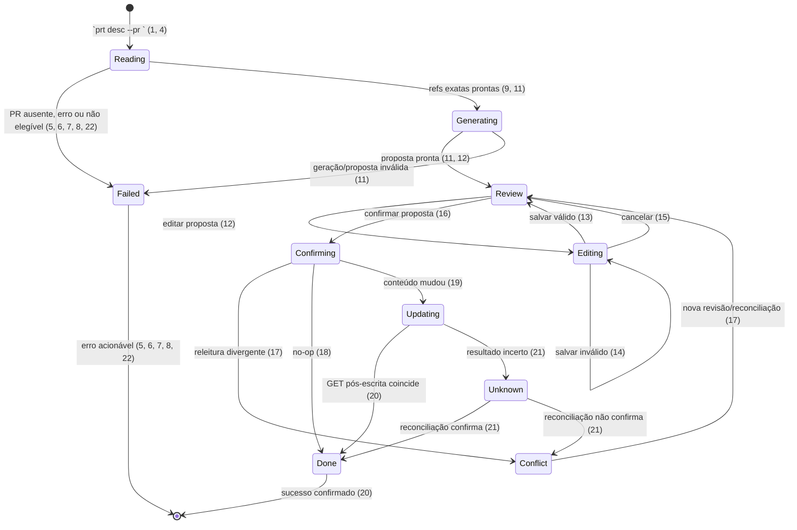

# Atualizar título e descrição de PR existente

> Build this with **tlc-implement**.
> Every criterion below becomes a check with a proof, referenced by its number. Nothing under
> `Unresolved` gets settled while building.

## Intent

Quem mantém PRs do Azure DevOps não consegue usar o `pr-tools` para atualizar um PR depois que
novos commits mudam o escopo real. Hoje a pessoa precisa abrir o Azure DevOps e editar título e
descrição manualmente, aproximadamente 3 vezes por semana. O tempo por caso não é medido. Sem
esta capacidade, o custo recorrente e o risco de deixar o registro remoto desatualizado permanecem;
recriar o PR não é um substituto aceitável porque perde a identidade e o histórico do PR existente.

Quando isto estiver pronto, uma pessoa poderá informar um único PR ativo no `prt desc --pr <id>`,
revisar o conteúdo remoto atual e uma proposta baseada nas refs exatas desse PR, editar a proposta,
confirmar e atualizar somente título e descrição do mesmo PR, com reconciliação antes e depois da
escrita. O design vinculante está em [issue-10-update-existing-pr.md](../.design/issue-10-update-existing-pr.md).

24 critérios em 4 slices · 6 decisões difíceis · 1 questão aberta, das quais 0 bloqueiam

## Criteria

### Entrada, elegibilidade e contexto remoto

1. Dado `prt desc --pr 42` com ID numérico positivo, quando a CLI é normalizada, então o fluxo de atualização recebe exatamente o PR `42` e executa uma única jornada de PR.
2. Quando `prt update` é invocado, então o comando continua selecionando o auto-update do binário e nenhuma chamada de atualização de PR é feita.
3. Dado `--pr` vazio, não numérico ou menor/igual a zero, quando os argumentos são analisados, então a CLI falha com código de saída `2`, usa a mensagem existente de ID inválido e não chama Azure nem o provider de IA.
4. Dado um ID válido, quando a leitura inicial é feita, então o fluxo chama `GET {project}/_apis/git/repositories/{repository}/pullRequests/{id}?api-version=7.1` no remote Azure atual e captura no snapshot o status, repositório, `sourceRefName`, `targetRefName`, `title` e `description` retornados.
5. Se a leitura inicial não encontrar o PR ou falhar, então a operação termina com erro acionável, não gera proposta e não envia `PATCH` nem `POST`.
6. Se o PR retornado não tiver status `active`, então a operação é bloqueada antes da geração e nenhuma escrita remota é feita.
7. Se o repositório retornado pelo Azure não corresponder ao repositório Azure do clone local, então a operação é bloqueada com orientação para executar no clone correspondente, sem gerar proposta nem escrever.
8. Se `sourceRefName` ou `targetRefName` estiver ausente ou não puder ser resolvido localmente ou como `origin/<branch>`, então a operação é bloqueada com orientação para atualizar/fazer fetch das refs, sem fallback para `dev`, `sprint/*`, `main` ou `master`.
9. Dado source e target resolvidos, quando o contexto Git é coletado, então o diff usa `target...source` e o log usa `target..source`, preservando as refs remotas do PR como autoridade.
10. Quando `--dry-run` é usado nessa jornada, então o prompt/contexto é apresentado sem chamar o provider de IA e sem executar `PATCH`, `POST` ou qualquer publisher de criação.

### Geração e revisão da proposta

11. Dado um PR elegível com contexto Git válido, quando a geração termina, então o prompt/proposta contém os source/target remotos, o diff e o log de `target..source`, além do título e da descrição atuais; falha de geração ou proposta inválida termina em estado de erro sem escrita.
12. Quando a proposta está pronta, então a tela de revisão mostra separadamente `Atual` (snapshot remoto) e `Proposta`, e somente a proposta fica editável antes da confirmação.
13. Quando uma edição válida é salva, então título e descrição finais passam a ser exatamente os buffers editados — incluindo whitespace, Unicode, quebras de linha e Markdown — enquanto `Atual` permanece byte a byte igual e o conteúdo não passa novamente por normalização.
14. Dado título vazio após `trim` ou body com `chars().count() >= 4000`, quando o usuário salva ou tenta confirmar, então o editor permanece aberto, mostra o erro no campo correspondente e nenhuma chamada remota é feita; body com `3999` caracteres é aceito e descrição remota vazia continua permitida.
15. Quando o usuário cancela com `Esc` ou abandona a revisão antes da confirmação, então o rascunho é descartado, a tela retorna sem alterar o snapshot e nenhuma escrita remota é feita; nenhum draft é persistido entre execuções.

### Confirmação, escrita e reconciliação

16. Quando o usuário confirma a proposta, então o título e a descrição aprovados são congelados antes da primeira chamada remota de escrita, e a edição permanece indisponível durante atualização, conflito e recuperação.
17. Antes de escrever, quando o fluxo relê o mesmo PR e compara status, repositório, source, target, título e descrição com o snapshot inicial, então qualquer divergência impede o `PATCH` e mostra um conflito que exige nova revisão/reconciliação.
18. Quando a releitura pré-escrita coincide com o snapshot e título/descrição propostos são byte a byte idênticos aos valores remotos, então a operação termina como no-op confirmado e não envia `PATCH`.
19. Quando a releitura pré-escrita coincide e há mudança aprovada, então é enviado ao mesmo PR um único `PATCH` com `Content-Type: application/json` e corpo JSON exatamente `{ "title": <título aprovado>, "description": <descrição aprovada> }`, sem `POST`, reviewers, labels, status, refs, opções de merge ou outro campo.
20. Quando o `PATCH` retorna resposta 2xx com payload válido, então o fluxo faz `GET` do mesmo PR e só declara sucesso quando `title` e `description` remotos coincidem exatamente com o resultado aprovado; qualquer divergência permanece não confirmada.
21. Se houver timeout, erro de transporte ou resposta 2xx sem payload válido após o envio, então o resultado é classificado como incerto, uma leitura de reconciliação ocorre antes de sucesso ou retry e nenhuma repetição cega de `PATCH` é feita.
22. Se o PAT estiver ausente ou o Azure responder HTTP `401`/`403`, então a operação não escreve e mostra a mensagem acionável existente sobre PAT, permissão e `prt doctor`.

### Provas da fronteira de atualização

23. Quando qualquer cenário de atualização é executado, então a confirmação só alcança a operação de update isolada e nunca `publish_pull_requests` ou o endpoint de criação de PR, preservando o fluxo de criação multi-target existente.
24. A suíte Rust contém provas para parse/isolamento da CLI, payload JSON mínimo e `Content-Type`, elegibilidade, refs exatas, PR inexistente/fechado, repositório incompatível, no-op, conflito, timeout/resposta inválida, reconciliação, autorização e snapshots da revisão/editor; `INSTA_UPDATE=no cargo test --manifest-path apps/rust/Cargo.toml --locked` passa sem atualizar snapshots automaticamente.

## States

## Out of scope

- merge/completion, auto-complete, reviewers, labels/checks/policies, alteração de target branch ou opções de merge — aumentariam o blast radius da primeira versão
- criação de PR, atualização em lote ou reutilização do publisher multi-target — a jornada atualiza um único PR existente
- resolução automática de conflitos de conteúdo — divergência remota exige nova revisão
- sincronização em background, histórico persistente de versões, drafts entre execuções e edição de Test Cases — não fazem parte da jornada atual
- alteração de `prt update` como auto-update do binário — o nome já tem esse contrato

## Observable

| Surface | Decision | Landing |
|---|---|---|
| command `prt desc --pr <id>` | output, verbosity, flags, exit codes and partial failure | 1, 3, 5, 6, 7, 8, 10, 22, 23 |
| command `prt desc --pr <id>` | `--raw`, execução sem TTY e combinação com `--create` | Unresolved 1 |
| command `prt update` | output, verbosity, flags and exit codes | existing - o comando continua sendo o auto-update do binário (2) |
| screen `prt desc / Atualização` | empty state | 5, 6, 7, 8 |
| screen `prt desc / Atualização` | loading state | 4, 9, 11 |
| screen `prt desc / Atualização` | error state | 5, 6, 7, 8, 11, 21, 22 |
| screen `prt desc / Atualização` | unauthorised state | existing - `client_for` exige PAT/remote e `AppError::Azure` preserva HTTP `401`/`403` |
| screen `prt desc / Atualização` | density and ordering | 4, 11, 12, 16, 17, 20, 21 |
| screen `prt desc / Atualização` | destructive action confirms | 16, 17, 19 |
| screen `prt desc / Editor de atualização` | empty state | 14 |
| screen `prt desc / Editor de atualização` | loading state | n/a - o editor só abre depois da proposta em revisão (12) |
| screen `prt desc / Editor de atualização` | error state | 14 |
| screen `prt desc / Editor de atualização` | unauthorised state | n/a - o editor não chama Azure; autorização permanece no limite remoto (22) |
| screen `prt desc / Editor de atualização` | density and ordering | 12, 13, 14, 15 |
| screen `prt desc / Editor de atualização` | destructive action confirms | n/a - salvar/cancelar alteram apenas o draft em memória |
| screen `prt desc / Conflito ou resultado incerto` | empty state | n/a - só aparece após uma tentativa remota |
| screen `prt desc / Conflito ou resultado incerto` | loading state | 21 |
| screen `prt desc / Conflito ou resultado incerto` | error state | 17, 21 |
| screen `prt desc / Conflito ou resultado incerto` | unauthorised state | existing - status HTTP e mensagem de autorização seguem o cliente Azure existente (22) |
| screen `prt desc / Conflito ou resultado incerto` | density and ordering | 16, 17, 20, 21 |
| screen `prt desc / Conflito ou resultado incerto` | destructive action confirms | 16, 17 |
| API `GET {project}/_apis/git/repositories/{repository}/pullRequests/{id}` | response shape | status, repositório, refs, título e descrição (4) |
| API `GET {project}/_apis/git/repositories/{repository}/pullRequests/{id}` | error shape with its codes | existing - `AzureClient::get` retorna `AppError::Azure` com status e corpo para HTTP `>=300` (5, 22) |
| API `GET {project}/_apis/git/repositories/{repository}/pullRequests/{id}` | who may call it | existing - `client_for` exige remote Azure e PAT |
| API `GET {project}/_apis/git/repositories/{repository}/pullRequests/{id}` | versioning | existing - `api-version=7.1` é anexado pelo cliente |
| API `GET {project}/_apis/git/repositories/{repository}/pullRequests/{id}` | rate limit | existing - não há retry automático; status Azure é propagado e o fluxo não escreve sem elegibilidade (5, 6, 21) |
| API `PATCH {project}/_apis/git/repositories/{repository}/pullRequests/{id}` | response shape | payload válido seguido de GET de confirmação (20) |
| API `PATCH {project}/_apis/git/repositories/{repository}/pullRequests/{id}` | error shape with its codes | existing - erro HTTP mantém status/corpo em `AppError::Azure`; timeout/transporte/2xx inválido seguem resultado incerto (21, 22) |
| API `PATCH {project}/_apis/git/repositories/{repository}/pullRequests/{id}` | who may call it | existing - mesmo remote Azure e PAT usados pelo cliente autenticado |
| API `PATCH {project}/_apis/git/repositories/{repository}/pullRequests/{id}` | versioning | existing - `api-version=7.1` |
| API `PATCH {project}/_apis/git/repositories/{repository}/pullRequests/{id}` | rate limit | existing - não há repetição automática; uma resposta sem confirmação entra em reconciliação (21) |
| API `POST {project}/_apis/git/repositories/{repository}/pullrequests` | update flow input | n/a - a atualização não chama o endpoint de criação (23) |
| document/copy body | structure, tone, depth and next action | n/a - não há nova superfície de cópia; o contrato body-only existente permanece fora da escrita do PR |
| collection of PRs | grouping criterion, naming, ordering, duplicates and exception | 1, 6, 7 - exatamente um PR por execução, sem lote; apenas `active` e repositório correspondente prosseguem |

## Swept

- validation: 3, 8, 9, 14
- failure modes: 5, 6, 7, 8, 11, 21, 22
- idempotency and retry: 18, 21
- authorization: existing - `client_for` exige PAT/remote e `AppError::Azure` preserva `401`/`403`
- concurrency and ordering: 16, 17, 18, 19, 20
- data lifecycle: 13, 15, 16 - drafts e conteúdo congelado vivem somente na execução atual; nada é persistido ou migrado
- external-dependency failure: 5, 11, 21, 22
- state transitions: 15, 16, 17, 18, 19, 20, 21
- observability: n/a - não há telemetria nova nesta issue; estados, mensagens e igualdade exata pós-GET são a observabilidade existente do fluxo

## Impact

| Front | What changes |
|---|---|
| domain | new term: `UpdatePrep` - contexto remoto, refs exatas, snapshot e proposta preparados para atualizar um PR; lives in `apps/rust/src/features/update_pull_request.rs` |
| domain | new term: `UpdateApp` - máquina de estados da leitura, revisão, edição, confirmação, conflito e reconciliação; lives in `apps/rust/src/tui/update_flow.rs` |
| domain | new term: `UpdatePullRequestInput` - allowlist de `title` e `description` para o PATCH; lives in `apps/rust/src/azure/pull_requests.rs` |
| domain | new term: `collect_for_refs` - coleta diff/log usando somente source e target fornecidos; lives in `apps/rust/src/git/mod.rs` |
| domain | existing term: `PullRequest` hoje carrega ID, título, descrição e refs; passa a carregar também status e identidade do repositório para elegibilidade e comparação - `get_pull_request` e o novo fluxo dependem dele |
| domain | existing term: `CliOptions.pr` hoje representa o PR usado como contexto de `prt test`; passa a também representar o ID que seleciona atualização em `prt desc` - `run_test`/`test_card::prepare` continuam consumidores do significado anterior |
| integration | existing term: `AzureClient` já autentica, anexa `api-version=7.1`, decodifica JSON e possui `PATCH` de JSON Patch para Work Items; recebe um método JSON `PATCH` separado sem mudar `post_patch`/`patch` de Work Items |
| integration | existing term: `run_desc` e o fluxo `DescribeApp` hoje geram e criam PRs; passam a encaminhar `--pr` para a fronteira isolada de update, enquanto o caminho sem `--pr` permanece criação |
| stored data | nothing to migrate - drafts, snapshots e resultados intermediários vivem somente em memória durante a execução |

## Decided

| Decision | Shape | Alternative rejected |
|---|---|---|
| update isolation | `UpdateApp`/`update_flow.rs` separado de `DescribeApp`/`live.rs`, compartilhando apenas primitives como editor, renderização, autenticação e coleta básica | um `DescribeApp` com `Mode::Create/Update`; rejeitado porque mistura confirmação de update com targets, reviewers, recovery e publisher de criação |
| remote authority | GET inicial e releitura usam o remote Azure atual e tratam status, repositório, `sourceRefName` e `targetRefName` remotos como autoridade | flags locais de source/target ou base inferida; rejeitados porque podem apontar a descrição para outro PR/base |
| Git context | `collect_for_refs(source_ref, target_ref)` resolve somente as refs do PR, localmente ou como `origin/<branch>`, e produz diff `target...source` e log `target..source` | fetch automático ou fallback para `sprint/dev/main/master`; rejeitados por introduzirem efeito de rede ou uma aproximação silenciosa |
| review content | o snapshot remoto atual permanece visível; `ContentEditState` edita somente `proposal`; confirmação envia o resultado final exato | substituir silenciosamente conteúdo remoto pela IA; rejeitado porque pode descartar notas humanas |
| remote payload | `PATCH` com `Content-Type: application/json` e corpo limitado a `title` e `description` | objeto completo do PR ou `AzureClient::patch` de JSON Patch; rejeitados porque podem alterar reviewers, status, refs ou outros metadados |
| concurrency | reler antes do PATCH e comparar status, repositório, refs, título e descrição; divergência bloqueia a escrita e exige nova revisão | ignorar a releitura ou inventar `If-Match`/`ETag`; rejeitados porque a API oficial consultada não documenta essa precondição para esta operação |

## Surface

| Route | In | Out | Status | Criteria |
|---|---|---|---|---|
| `prt desc --pr <id>` | um ID positivo de PR; flags existentes, sujeito a `Unresolved 1` | estados de leitura, proposta, revisão, conflito e sucesso/erro | código `2` para CLI inválida; `1` para erro de operação; sucesso somente após GET confirmatório | 1, 3, 5, 6, 7, 8, 10, 20, 21, 22 |
| `GET {project}/_apis/git/repositories/{repository}/pullRequests/{id}` | projeto, repositório e ID do PR no remote Azure | status, repositório, refs, título e descrição | 2xx válido; `>=300` vira `AppError::Azure`; payload ausente/inválido não autoriza escrita | 4, 5, 6, 7, 8, 17, 21 |
| `PATCH {project}/_apis/git/repositories/{repository}/pullRequests/{id}` | `Content-Type: application/json`; somente `title` e `description` | PR atualizado, seguido por GET do mesmo ID | 2xx válido exige confirmação; timeout/transporte/2xx inválido é resultado incerto; sem retry cego | 18, 19, 20, 21 |
| `POST {project}/_apis/git/repositories/{repository}/pullrequests` | payload de criação multi-target existente | PR criado pelo fluxo sem `--pr` | existing - não é chamado pela atualização | 2, 23 |

## Sources

- [`issue-10-update-existing-pr.md`](../.design/issue-10-update-existing-pr.md) - **binding for the interface**: entrada `prt desc --pr <id>`, jornada, estados, limites, payload mínimo, isolamento, reconciliação e escopo
- [`apps/rust/src/cli.rs`](../apps/rust/src/cli.rs) - `DescOpts`, `TestOpts`, `CliOptions`, `WorkItemId` e o significado já ocupado de `prt update`
- [`apps/rust/src/main.rs`](../apps/rust/src/main.rs) - dispatch atual de `run_desc`, modo TUI/plain e dry-run
- [`apps/rust/src/azure/pull_requests.rs`](../apps/rust/src/azure/pull_requests.rs) - modelo `PullRequest`, GET por ID, payload/endpoint de criação e publisher multi-target que não deve ser reutilizado
- [`apps/rust/src/azure/mod.rs`](../apps/rust/src/azure/mod.rs) - autenticação, `api-version=7.1`, `AppError::Azure`, `post_patch`/`patch` de Work Items e ponto para o PATCH JSON separado
- [`apps/rust/src/git/mod.rs`](../apps/rust/src/git/mod.rs) - `RepositoryRemote`, `ChangeContext`, resolução local/`origin` e coleta atual com base inferida que precisa da variante orientada a refs
- [`apps/rust/src/features/describe.rs`](../apps/rust/src/features/describe.rs) - preparação de contexto, configuração Azure, classificação de falhas e timeout da TUI
- [`apps/rust/src/tui/content_editor.rs`](../apps/rust/src/tui/content_editor.rs) - `ContentEditState`, validação `< 4000`, edição Unicode/multilinha e preservação sem normalização
- [`apps/rust/src/tui/describe_app.rs`](../apps/rust/src/tui/describe_app.rs) e [`apps/rust/src/tui/live.rs`](../apps/rust/src/tui/live.rs) - estados atuais de revisão, confirmação, publicação e recuperação, mantidos separados do update
- [`apps/rust/src/error.rs`](../apps/rust/src/error.rs) - códigos de saída e representação de erros CLI, Git, Azure e descrição longa
- [`apps/rust/Cargo.toml`](../apps/rust/Cargo.toml) - suíte Rust, Insta e ausência de um cliente HTTP mock já declarado
- [Pull Requests - Update](https://learn.microsoft.com/en-us/rest/api/azure/devops/git/pull-requests/update?view=azure-devops-rest-7.1) - método `PATCH`, `application/json`, campos atualizáveis e limite de 4000 caracteres
- [Get Pull Request](https://learn.microsoft.com/en-us/rest/api/azure/devops/git/pull-requests/get-pull-request?view=azure-devops-rest-7.1) - leitura por ID e campos de status, repositório, refs e conteúdo
- [Azure DevOps REST API guide](https://learn.microsoft.com/en-us/azure/devops/integrate/how-to/call-rest-api?view=azure-devops) - autenticação/headers e distinção entre JSON e JSON Patch

This task is the record of decision. If a linked document diverges, ask before building.

## Unresolved

| # | Kind | Question | Until answered |
|---|---|---|---|
| 1 | open | Qual é o comportamento de `--raw`, execução sem TTY e `--create` quando combinados com `prt desc --pr <id>`? | Default recomendado: rejeitar a combinação com código `2` antes de qualquer escrita, pois a atualização exige revisão interativa; `--dry-run` continua coberto pelo critério 10. |
