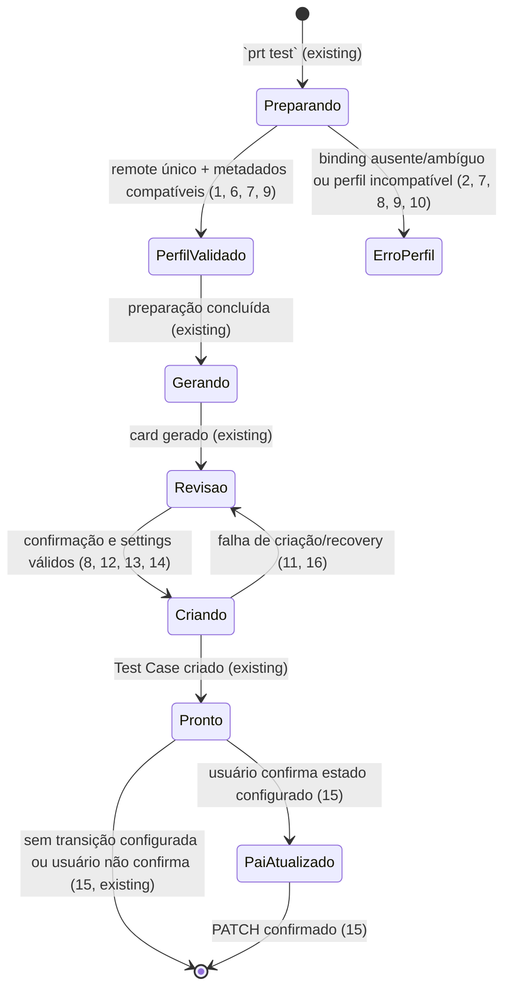

# Perfis de processo Azure por repositório

> Implemente com **tlc-implement** (`.agents/skills/tlc-implement/SKILL.md`). Cada critério abaixo vira uma checagem com uma prova referenciada pelo seu número. Nada em `Unresolved` deve ser decidido durante a implementação.

## Intent

Hoje a configuração do `prt` é global e o fluxo de Test Case assume `Custom.Team`, `Custom.ProgramasAgrotrace` e o estado `Test QA`. Quem alterna entre repositórios/projetos Azure precisa editar essa configuração global ou só descobre a incompatibilidade durante uma escrita remota; isso acopla o binário ao processo do projeto original. A issue não fornece métricas de frequência ou custo, mas identifica como caso real o projeto `CHECKMILK`, na mesma organização Azure do perfil atual.

Quando isto estiver disponível, `prt test` resolverá o perfil associado ao remote Azure atual, exibirá o perfil ativo e preparará o Test Case com os campos/defaults desse processo. O perfil existente será nomeado `Agrotrace`; o novo perfil será `CheckMilk`. Ambos usam os mesmos settings, `Custom.Team` e o estado `Test QA`; a diferença de campo é `Custom.ProgramasAgrotrace` no perfil `Agrotrace` versus `Custom.ProgramasCheckmilk` no perfil `CheckMilk`. Cada perfil também pode definir seus próprios revisores padrão de `dev` e `sprint`. A configuração antiga será migrada automaticamente para `Agrotrace`, que funcionará como perfil padrão/fallback até que um binding explícito, como o de `CheckMilk`, o substitua; o wizard poderá criar/associar perfis e o `doctor` apontará bindings incompatíveis antes da criação.

23 critérios em 5 slices · 9 decisões de mão única · 3 abertas, nenhuma bloqueia

## Criteria

### Seleção e compatibilidade legada

1. Dada uma configuração com pelo menos 2 perfis explícitos e 2 bindings de repositório, quando `prt test` é preparado a partir de cada clone, então cada execução seleciona exatamente o perfil associado ao remote `(organization, project, repository)` retornado por `RepositoryRemote` e disponibiliza esse identificador para a revisão.
2. Dada uma configuração em que dois perfis correspondem ao mesmo remote Azure, quando a configuração é validada, então a execução falha antes de qualquer `POST` de Test Case ou `PATCH` do Work Item pai e a mensagem identifica o remote e os perfis conflitantes.
3. Dada uma configuração antiga sem a seção de perfis explícitos, na primeira execução da nova funcionalidade a implementação materializa de forma idempotente o perfil `Agrotrace` a partir de `test_area_path`, `test_assigned_to`, `test_team`, `test_program`, `reviewer_dev` e `reviewer_sprint`, persiste `defaultProfile: "Agrotrace"` e preserva a prioridade `2`, a herança de `IterationPath` e a transição `Test QA`; `prt test`/`prt desc` continuam funcionando sem migração manual.
4. Dado o mesmo remote Azure clonado em dois diretórios locais diferentes, quando `prt test` é preparado, então a seleção do perfil é idêntica nos dois diretórios e nenhuma decisão usa o caminho local como chave.
5. Quando uma configuração antiga é migrada, então a operação é atômica e repetível, cria somente um perfil `Agrotrace` e não duplica bindings; os valores não secretos podem permanecer nas chaves legadas durante a janela de compatibilidade, mas `azurePat`, `apiKey` e outros segredos nunca são copiados para o perfil e continuam no mecanismo atual de credenciais (`.env`/ambiente/configuração existente).

### Descoberta e validação antes da escrita

6. Dado um perfil selecionado, antes da primeira escrita do fluxo, então o cliente consulta a disponibilidade do Work Item Type `Test Case` no projeto remoto e bloqueia a criação se esse tipo não existir.
7. Dado o perfil `Agrotrace` ou `CheckMilk`, antes do primeiro `POST` de Test Case, então a implementação valida os campos fixos do perfil (`Custom.Team` e o respectivo `Custom.Programas...`) nos metadados do tipo `Test Case` e bloqueia quando um `referenceName` não existe, quando o tipo não é compatível ou quando um valor não atende as restrições retornadas pelo Azure; nenhum campo arbitrário é aceito.
8. Dado um campo do perfil marcado como obrigatório sem default e sem valor fornecido no fluxo de revisão, quando o usuário tenta criar o Test Case, então a operação mostra o `referenceName` do campo e não executa nenhuma escrita remota.
9. Dado um estado de transição configurado no perfil, quando os estados do Work Item Type do pai são consultados, então um estado ausente é rejeitado antes do `PATCH`; para o processo `CHECKMILK`, o valor confirmado `Test QA` é usado literalmente quando o perfil o declarar.
10. Se a consulta de metadados necessária para validar o perfil responder com erro HTTP, timeout ou falha de transporte antes da criação, então nenhum `POST` de Test Case nem `PATCH` de pai é iniciado e a falha identifica a etapa de validação sem expor PAT ou API key.
11. Depois que um perfil é selecionado para uma execução, o snapshot do perfil acompanha `TestCardPrep`; a criação, a busca de candidatos e o retry após resultado incerto usam esse mesmo snapshot, mesmo quando a recuperação relê o PAT atual.

### Settings e payload do Test Case

12. Dado o perfil associado ao remote atual, quando a revisão do `prt test` é exibida, então ela mostra o identificador (`Agrotrace` ou `CheckMilk`), os settings do Test Case, o mapeamento do campo de programa e os revisores padrão de `dev`/`sprint` resolvidos pelo perfil.
13. Dado o perfil legado/`Agrotrace` com valores não vazios, quando o Test Case é criado, então o payload mantém os campos padrão existentes e envia `Custom.Team` e `Custom.ProgramasAgrotrace`; os overrides já existentes de `--team` e `--program` continuam prevalecendo sobre os defaults.
14. Dado o perfil `CheckMilk` associado ao projeto `CHECKMILK`, quando o Test Case é criado, então o json-patch mantém todos os campos e valores do fluxo atual, troca somente o caminho do programa para `/fields/Custom.ProgramasCheckmilk` e envia o valor `Checkmilk`, sem enviar `/fields/Custom.ProgramasAgrotrace`.
15. Quando um perfil não declara uma transição de pai, após a criação bem-sucedida do Test Case o fluxo não oferece nem executa `PATCH` de estado; quando declara `Test QA` e o usuário confirma a atualização, o patch mantém os esforços existentes e grava `System.State` exatamente como `Test QA`.
16. Se a criação do Test Case falhar depois do envio, então o recovery existente continua exibindo o perfil e os campos da tentativa, procura candidatos usando os campos efetivamente enviados e nunca reenvia automaticamente sem a decisão explícita do usuário.

### Wizard e diagnóstico

17. Dado um perfil com `reviewerDev` e `reviewerSprint` próprios, quando `prt desc` resolve os reviewers para os targets `dev` e `sprint`, então usa os valores do perfil selecionado, mantendo a edição manual e os overrides existentes com precedência sobre os defaults.
18. Dado o mesmo remote em dois comandos que usam targets diferentes, quando os reviewers são resolvidos, então cada target usa o reviewer padrão correspondente (`reviewerDev` ou `reviewerSprint`) do mesmo perfil e não mistura valores do perfil legado ou de outro repositório.
19. Quando `prt init` é executado dentro de um clone Azure válido, o wizard permite criar ou editar um perfil, seus revisores padrão de `dev`/`sprint` e sua associação ao remote atual `(organization, project, repository)`; a tela de revisão mostra esses dados antes de salvar.
20. No wizard, somente os dois schemas suportados podem ser configurados: `Agrotrace` (`Custom.Team` + `Custom.ProgramasAgrotrace`) e `CheckMilk` (`Custom.Team` + `Custom.ProgramasCheckmilk`), com os revisores padrão de `dev`/`sprint`; um campo, tipo ou configuração fora desse conjunto falha antes de persistir.
21. Quando um perfil altera os campos, revisores ou transição usados por `prt test`/`prt desc`, a tela de revisão mostra o perfil ativo e os valores finais antes do diálogo existente de confirmação; `--no-create` continua sem escrever no Azure.
22. Quando `prt doctor` encontra binding ausente, binding ambíguo, campo inexistente/não suportado, estado inválido ou reviewer padrão inválido, então imprime um check `[FALHA]` com remote, perfil e correção acionável e retorna código `1`; para uma associação e validação válidas, o check correspondente é `[OK]`.

### Documentação e provas

23. A documentação do projeto descreve o formato persistido em `config.json`, a identidade usada no binding, os perfis `Agrotrace` e `CheckMilk`, o perfil legado implícito, o mapeamento fixo de `Custom.Team` e dos dois campos de programa, os revisores padrão por target, a ausência de segredos nos perfis e os comandos `prt init`/`prt doctor`; a suíte Rust cobre configuração legada, seleção de 2 perfis, conflito de binding, validação de metadados, campo incompatível, payload de `Agrotrace` e `CheckMilk`, reviewers por perfil, estado opcional, recuperação e ausência de segredos, e `cargo test --manifest-path apps/rust/Cargo.toml --locked` passa.

## States

## Out of scope

- suporte genérico a qualquer custom field, tipo ou regra Azure - a primeira versão suporta somente os schemas fixos de `Agrotrace` e `CheckMilk`
- descoberta irrestrita de todos os campos para montar um formulário dinâmico - o wizard expõe somente os dois mapeamentos fixos suportados
- editor visual ou alteração do Process Template no Azure DevOps - o perfil só descreve metadados locais
- criação de novos processos, migração de Work Items, sincronização remota de perfis ou multi-tenancy SaaS - não são necessários para selecionar e usar um perfil local
- duplicação de PAT, API key ou credenciais por perfil - credenciais continuam globais no mecanismo existente
- alteração do comportamento de geração/publicação de `prt desc`, dos providers LLM ou de integrações GitHub/Jira - a resolução de reviewers por perfil é a única extensão de `prt desc`

## Observable

| Surface                                                   | Decision                                             | Landing                                                                                                                                  |
| --------------------------------------------------------- | ---------------------------------------------------- | ---------------------------------------------------------------------------------------------------------------------------------------- |
| screen `prt init / Perfil de processo`                    | empty state                                          | 3, 20                                                                                                                                    |
| screen `prt init / Perfil de processo`                    | loading state                                        | existing - não há descoberta dinâmica de fields                                                                                         |
| screen `prt init / Perfil de processo`                    | error state                                          | 2, 7, 9, 18                                                                                                                              |
| screen `prt init / Perfil de processo`                    | unauthorised state                                   | existing - o perfil não contém credenciais                                                                                               |
| screen `prt init / Perfil de processo`                    | density and ordering                                 | 12, 19, 20 - perfil, binding, settings e reviewers                                                                                       |
| screen `prt init / Perfil de processo`                    | destructive action confirms                          | n/a - salvar perfil altera somente a configuração local e a revisão existente já antecede o salvamento                                   |
| screen `prt test / Preparação e revisão`                  | empty state                                          | 8, 12                                                                                                                                    |
| screen `prt test / Preparação e revisão`                  | loading state                                        | 6, 7, 9, 10                                                                                                                              |
| screen `prt test / Preparação e revisão`                  | error state                                          | 2, 7, 8, 9, 10, 16                                                                                                                       |
| screen `prt test / Preparação e revisão`                  | unauthorised state                                   | 10, existing - `client_for` exige PAT/remote e `AppError::Azure` preserva os status `401`/`403`                                          |
| screen `prt test / Preparação e revisão`                  | density and ordering                                 | 1, 12, 21 - settings comuns e mapeamento do programa                                                                                     |
| screen `prt test / Preparação e revisão`                  | destructive action confirms                          | existing - `TestDialog::ConfirmCreate` e a confirmação de atualização do pai antecedem as escritas                                       |
| screen `prt doctor / Checks`                              | empty state                                          | n/a - o diagnóstico atual sempre exibe checks ou seu relatório de contingência                                                           |
| screen `prt doctor / Checks`                              | loading state                                        | existing - `DoctorFlowApp` mostra verificação indeterminada antes do relatório                                                           |
| screen `prt doctor / Checks`                              | error state                                          | 22                                                                                                                                       |
| screen `prt doctor / Checks`                              | unauthorised state                                   | existing - o diagnóstico atual reporta PAT e HTTP `401`/`403` sem exibir segredo                                                         |
| screen `prt doctor / Checks`                              | density and ordering                                 | 22, existing - lista de checks navegável                                                                                                 |
| screen `prt doctor / Checks`                              | destructive action confirms                          | n/a - `doctor` somente consulta e reporta                                                                                                |
| API `GET {project}/_apis/wit/workitemtypes`               | response shape                                       | lista de Work Item Types; `Test Case` deve estar presente (6)                                                                            |
| API `GET {project}/_apis/wit/workitemtypes/{type}/fields` | response shape                                       | `referenceName`, tipo e metadados de required/default/allowed values usados na validação (7, 8, 14)                                      |
| API `GET {project}/_apis/wit/workitemtypes/{type}/states` | response shape                                       | estados do Work Item Type pai; `Test QA` é validado quando configurado (9)                                                               |
| API metadata Azure                                        | error shape with its codes                           | existing - `AzureClient::get` retorna `AppError::Azure` com status e corpo resumido; 401/403/429/5xx/transporte não iniciam escrita (10) |
| API metadata Azure                                        | who may call it                                      | existing - `client_for` exige remote Azure e PAT; perfis não carregam credenciais                                                        |
| API metadata Azure                                        | versioning                                           | existing - `AzureClient` anexa `api-version=7.1`                                                                                         |
| API metadata Azure                                        | rate limit                                           | 10 - não há retry automático antes da decisão de criação                                                                                 |
| API `POST {project}/_apis/wit/workitems/$Test Case`       | response/error shape                                 | existing `WorkItem`/`CreateFailure`, com fields padrão + mapeamento fixo do perfil (11, 13, 14, 16)                                      |
| API `POST {project}/_apis/wit/workitems/$Test Case`       | who may call it                                      | existing - PAT e remote Azure válidos                                                                                                    |
| API `POST {project}/_apis/wit/workitems/$Test Case`       | versioning                                           | existing - `api-version=7.1` e `application/json-patch+json`                                                                             |
| API `POST {project}/_apis/wit/workitems/$Test Case`       | rate limit                                           | existing - recovery de resultado incerto; nenhum retry cego (16)                                                                         |
| API `PATCH {project}/_apis/wit/workitems/{id}`            | response/error shape                                 | json-patch existente para esforços + `System.State` opcional do perfil (15)                                                              |
| API `PATCH {project}/_apis/wit/workitems/{id}`            | who may call it                                      | existing - PAT com permissão de Work Items                                                                                               |
| API `PATCH {project}/_apis/wit/workitems/{id}`            | versioning                                           | existing - `api-version=7.1` e `application/json-patch+json`                                                                             |
| command `prt init`                                        | output, verbosity, flags and exit codes              | 19, 20, 21, 23; flags atuais não ganham segredo nem migração obrigatória                                                                 |
| command `prt test`                                        | output, verbosity, flags and exit codes              | 1, 3, 8, 12, 13, 14, 21; `--team`, `--program` e `--no-create` preservam seus contratos definidos                                      |
| command `prt desc`                                        | output, verbosity, flags and exit codes              | 17, 18, 21, 23; reviewers do perfil podem ser editados antes da publicação                                                              |
| command `prt doctor`                                      | output, verbosity and exit codes                     | 22; perfil inválido é `[FALHA]` e código `1`                                                                                             |
| document/copy body                                        | structure, tone, depth and next action               | n/a - a feature não altera o contrato body-only do clipboard                                                                             |
| collection of profiles/bindings                           | grouping, naming, ordering, duplicates and exception | 1, 2, 4, 12, 17, 18, 19, 20                                                                                                               |

## Swept

- validation: 6, 7, 8, 9, 10, 18
- failure modes: 2, 7, 8, 9, 10, 16, 22
- idempotency and retry: 11, 16
- authorization: existing - `client_for` exige PAT/remote, `AzureClient` preserva 401/403 e 5 mantém segredos fora dos perfis
- concurrency and ordering: 1, 4, 11, 12, 17, 18
- data lifecycle: 3, 5, 23 - `config.json` recebe dados persistentes de perfil, incluindo reviewers não secretos; a configuração antiga é lida sem migração manual e não há backfill de Work Items
- external-dependency failure: 6, 7, 9, 10, 16
- state transitions: 3, 9, 15, 16
- observability: 1, 12, 17, 22, 23 - perfil ativo e reviewers resolvidos aparecem nos fluxos e diagnósticos reportam binding/metadados sem segredos; não há telemetria nova fora da saída existente

## Impact

| Front       | What changes                                                                                                                                                                                                                                                         |
| ----------- | -------------------------------------------------------------------------------------------------------------------------------------------------------------------------------------------------------------------------------------------------------------------- |
| domain      | new term: `ProcessProfile` - nome do perfil, defaults compartilhados, revisores padrão de `dev`/`sprint` e mapeamento fixo do campo de programa; `Agrotrace` usa `Custom.ProgramasAgrotrace` e `CheckMilk` usa `Custom.ProgramasCheckmilk` |
| domain      | new term: `RepositoryProfileBinding` - associação explícita entre um perfil e a identidade `(organization, project, repository)`; a resolução usa `RepositoryRemote` em vez do diretório local                                                                       |
| domain      | new term: `ProfileSelection` - resultado único da resolução usado durante a preparação e congelado em `TestCardPrep` para criação/recovery                                                                                                                           |
| domain      | existing term: `Config` hoje é uma configuração plana global; passa a carregar dados de perfis e um perfil padrão, sem alterar a precedência de CLI/env/dotenv/config/defaults para a configuração legada nem exigir migração manual |
| domain      | existing term: `TestSettings` hoje tem 6 campos fixos e `TestSettingsField` conhece `Custom.Team`/`Custom.ProgramasAgrotrace`; passa a preservar os 6 settings e selecionar o `referenceName` do programa pelo perfil, preservando overrides legados e o foco da TUI |
| integration | existing term: `TestCaseInput`/`build_create_patch` hoje codificam `Custom.Team` e `Custom.ProgramasAgrotrace`; passam a trocar somente o caminho do programa para `Custom.ProgramasCheckmilk` no perfil `CheckMilk`, sem transformar a feature em uma linguagem genérica Azure |
| integration | existing term: `update_parent_to_test_qa`/`build_test_qa_patch` hoje sempre gravam `Test QA`; passam a receber uma transição opcional do perfil, mantendo esforços e o comportamento legado implícito                                                                |
| integration | existing term: `AzureClient` já autentica, anexa `api-version=7.1` e devolve erros tipados; será reutilizado para listar Work Item Types, fields e states antes da escrita                                                                                           |
| interface   | existing terms: `InitDraft`/`InitWizard`, `TestApp`, `DescribeApp` e `DoctorReport` passam a exibir e validar perfil, binding, fields e reviewers sem revelar credenciais; os providers de IA não mudam |
| stored data | `config.json` recebe configuração aditiva de perfis/bindings, incluindo `reviewerDev`, `reviewerSprint` e o perfil padrão `Agrotrace`; a migração preserva chaves legadas não secretas durante a compatibilidade. Não há banco, backfill ou migração de Work Items; `.env` continua reservado para segredos/overrides atuais |

## Decided

| Decision                | Shape                                                                                                                                                         | Alternative rejected                                                                                                                                             |
| ----------------------- | ------------------------------------------------------------------------------------------------------------------------------------------------------------- | ---------------------------------------------------------------------------------------------------------------------------------------------------------------- |
| configuração persistida | continuar em `config.json`, com a serialização/precedência JSON existente e identificadores Azure sem tradução                                                | YAML ou um arquivo paralelo; rejeitados porque o loader atual, o wizard e a compatibilidade já usam `config.json`                                                |
| compatibilidade         | perfil legado implícito/migrado derivado de `test_area_path`, `test_assigned_to`, `test_team`, `test_program`, `reviewer_dev`, `reviewer_sprint`, prioridade `2`, herança de iteração e estado `Test QA` | quebrar configurações antigas ou exigir edição manual; rejeitado porque a nova versão deve migrar e continuar operando imediatamente |
| migração inicial        | na primeira execução da funcionalidade, ausência de `profiles` materializa `Agrotrace` com os settings e reviewers legados, `Custom.ProgramasAgrotrace` e `Test QA`, grava `defaultProfile: "Agrotrace"` de forma atômica e idempotente; falha mantém o arquivo anterior | exigir criação manual do perfil ou migrar somente ao selecionar um repositório; rejeitado porque a configuração existente deve continuar válida imediatamente e em todos os clones |
| identidade do binding   | tupla exata `(organization, project, repository)` de `RepositoryRemote`; diretório local não participa da seleção                                             | somente diretório ou nome de projeto; rejeitados porque clones mudam de caminho e nomes de projeto/repositório não são identidade suficiente fora da organização |
| unicidade               | uma execução deve produzir no máximo 1 `ProfileSelection`; conflito de correspondência é erro explícito antes da escrita                                      | escolher o primeiro match ou sobrescrever silenciosamente; rejeitados porque poderiam aplicar o processo errado ao Test Case                                     |
| fronteira de segredo    | PAT/API key permanecem no mecanismo global atual; `ProcessProfile` contém somente metadados e defaults não secretos                                           | credencial por perfil; rejeitada pelo escopo e pelo risco de duplicação/exposição de segredos                                                                    |
| validação remota        | confirmar Work Item Type, fields e state com metadados Azure antes da primeira escrita                                                                        | deixar o `POST` descobrir a incompatibilidade; rejeitado porque a issue exige falha clara antes de iniciar a criação                                             |
| schemas e reviewers     | `Agrotrace` usa `Custom.Team` + `Custom.ProgramasAgrotrace`; `CheckMilk` usa `Custom.Team` + `Custom.ProgramasCheckmilk`; ambos compartilham os demais settings, `Test QA` e permitem reviewers padrão próprios de `dev`/`sprint` | fields arbitrários ou reviewers somente globais; rejeitados porque a variação conhecida é fixa, enquanto defaults de review precisam acompanhar o processo/repositório |
| snapshot da execução    | a seleção e os valores do perfil acompanham `TestCardPrep` e recovery; reler configuração para PAT não troca o processo da tentativa                          | reselecionar o perfil em cada retry; rejeitado porque pode misturar campos de processos diferentes depois de uma resposta remota incerta                         |

## Surface

| Route                                                 | In                                                                        | Out                                                    | Status                                                                          | Criteria        |
| ----------------------------------------------------- | ------------------------------------------------------------------------- | ------------------------------------------------------ | ------------------------------------------------------------------------------- | --------------- |
| `GET {project}/_apis/wit/workitemtypes`               | projeto Azure do remote e PAT                                             | lista de Work Item Types                               | 2xx com `Test Case`; `>=300` vira erro de validação sem escrita                 | 6, 10           |
| `GET {project}/_apis/wit/workitemtypes/{type}/fields` | tipo `Test Case`, `$expand=all` e PAT                                     | `referenceName`, tipo, required/default/allowed values | 2xx com metadados; campo ausente/não suportado bloqueia                         | 7, 8, 10        |
| `GET {project}/_apis/wit/workitemtypes/{type}/states` | tipo do Work Item pai e PAT                                               | estados válidos                                        | 2xx; estado configurado ausente bloqueia                                        | 9, 10           |
| `POST {project}/_apis/wit/workitems/$Test Case`       | json-patch com campos padrão + fields do perfil validados                 | `WorkItem` ou `CreateFailure`                          | `application/json-patch+json`; resultado incerto segue recovery existente       | 11, 13, 14, 16  |
| `PATCH {project}/_apis/wit/workitems/{id}`            | json-patch de esforços e, somente se configurado, `System.State`          | confirmação da atualização                             | `application/json-patch+json`; sem transição configurada não há chamada         | 15              |
| `prt init`                                            | remote atual, perfil, binding e valores suportados; sem segredo no perfil | configuração salva e revisão final                     | código existente de sucesso/erro; falha não salva configuração inválida         | 3, 5, 19, 20, 21, 23 |
| `prt test`                                            | clone Azure atual e configuração; flags existentes                        | revisão com perfil/settings e criação opcional         | sem binding/perfil compatível falha antes da escrita; `--no-create` não escreve | 1, 3, 8, 12, 13, 14, 21 |
| `prt desc`                                            | clone Azure atual e configuração; target existente                        | revisão com perfil/reviewer e publicação opcional      | reviewers padrão vêm do perfil; edição manual permanece disponível             | 3, 17, 18, 21, 23       |
| `prt doctor`                                          | remote/PAT/configuração                                                   | checks de perfil, binding e compatibilidade            | `[FALHA]` + código `1` para inválido; `[OK]` para válido                        | 22              |

## Sources

- [GitHub issue #14](https://github.com/nitoba/pr-tools/issues/14) - **binding source for scope**: perfis por repositório, compatibilidade, validação pré-escrita, UX, segurança, fora de escopo e critérios de aceitação
- Solicitação do usuário em 15/09/2026 - perfil atual `Agrotrace`, novo perfil `CheckMilk`, mesmos campos/settings/regras de review e única troca de `Custom.ProgramasAgrotrace` por `Custom.ProgramasCheckmilk`; processo `CHECKMILK` na mesma organização e estado `Test QA`, com valor `Checkmilk`
- [`apps/rust/src/config/mod.rs`](../apps/rust/src/config/mod.rs) - `Config`, `config.json`, serialização `camelCase`, precedência e defaults atuais
- [`apps/rust/src/features/init.rs`](../apps/rust/src/features/init.rs) e [`apps/rust/src/tui/init_wizard.rs`](../apps/rust/src/tui/init_wizard.rs) - draft, defaults `DevOps`/`Agrotrace`, reviewers de `dev`/`sprint`, revisão e armazenamento seguro de PAT/API key
- [`apps/rust/src/git/mod.rs`](../apps/rust/src/git/mod.rs) - `RepositoryRemote` e parsing de organização/projeto/repositório Azure
- [`apps/rust/src/features/test_card.rs`](../apps/rust/src/features/test_card.rs) e [`apps/rust/src/tui/test_flow.rs`](../apps/rust/src/tui/test_flow.rs) - `TestSettings`, revisão de 6 campos, preparação, criação, recovery e atualização do pai
- [`apps/rust/src/tui/describe_app.rs`](../apps/rust/src/tui/describe_app.rs) e [`apps/rust/src/tui/live.rs`](../apps/rust/src/tui/live.rs) - resolução atual de reviewers por target e publicação de PRs
- [`apps/rust/src/azure/work_items.rs`](../apps/rust/src/azure/work_items.rs) - json-patch atual, custom fields codificados e transição fixa `Test QA`
- [`apps/rust/src/azure/mod.rs`](../apps/rust/src/azure/mod.rs) - autenticação, `api-version=7.1`, headers e `AppError::Azure`
- [`apps/rust/src/features/doctor.rs`](../apps/rust/src/features/doctor.rs) e [`apps/rust/src/tui/doctor_flow.rs`](../apps/rust/src/tui/doctor_flow.rs) - relatório, checks, mensagens e exit code do diagnóstico
- [`README.md`](../README.md) e [`AGENTS.md`](../AGENTS.md) - contrato de configuração/CLI, comandos de validação e convenções de teste
- [Azure DevOps REST - List Work Item Types](https://learn.microsoft.com/en-us/rest/api/azure/devops/wit/work-item-types/list?view=azure-devops-rest-7.1) - endpoint para confirmar `Test Case`
- [Azure DevOps REST - List Work Item Type Fields](https://learn.microsoft.com/en-us/rest/api/azure/devops/wit/work-item-types-field/list?view=azure-devops-rest-7.1) - endpoint e expansão dos metadados de fields
- [Azure DevOps REST - List Work Item Type States](https://learn.microsoft.com/en-us/rest/api/azure/devops/wit/work-item-type-states/list?view=azure-devops-rest-7.1) - endpoint para validar estados do pai

This task is the record of decision. If a linked document diverges, ask before building.

## Unresolved

| #   | Kind   | Question                                                                                                                                                                                                                                                                                                               | Until answered                                                                                                                                                   |
| --- | ------ | ---------------------------------------------------------------------------------------------------------------------------------------------------------------------------------------------------------------------------------------------------------------------------------------------------------------------- | ---------------------------------------------------------------------------------------------------------------------------------------------------------------- |
| 1   | open   | Qual é o repositório do projeto `CHECKMILK` que receberá o binding do perfil `CheckMilk`? | O schema dos perfis já está fechado; até responder, os critérios e testes podem usar um remote de fixture e a configuração real do binding fica pendente. |
| 2   | open   | Além de fields e estado `Test QA`, existe algum comportamento de QA habilitado/desabilitado pelo perfil?                                                                                                                                                                                                               | Default: nenhum comportamento adicional até ser nomeado; os critérios cobrem somente fields/defaults e transição opcional.                                       |
| 3   | open   | Quando a consulta de metadados Azure não puder ser concluída, a criação deve bloquear ou avisar e permitir continuar?                                                                                                                                                                                                  | Default recomendado: bloquear antes de qualquer escrita, conforme o requisito de não descobrir incompatibilidade no primeiro `POST`.                             |
