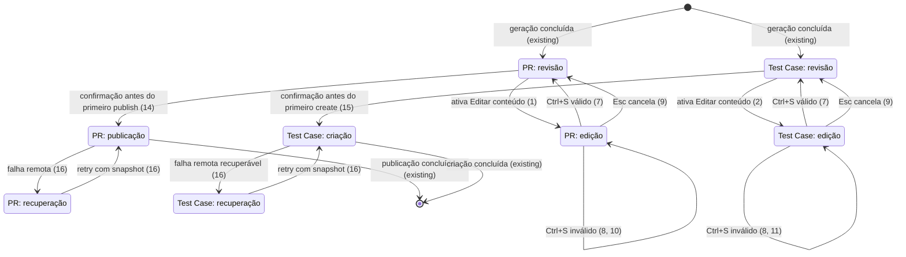

# Editar título e Markdown antes da publicação

> Implemente com **tlc-implement** (`.agents/skills/tlc-implement/SKILL.md`). Cada critério abaixo vira uma checagem com uma prova referenciada pelo seu número. Nada em `Unresolved` deve ser decidido durante a implementação.

## Intent

Hoje, quem usa `prt desc` ou `prt test` consegue revisar o conteúdo gerado, mas não consegue corrigir título ou corpo Markdown dentro do fluxo. A pessoa precisa sair para outro editor, abandonar a revisão ou corrigir o registro depois da publicação. Uma correção factual pode chegar errada ao Azure, e uma publicação para vários targets pode criar vários registros antes de o erro ser percebido. Não existe métrica de abandono do fluxo; o proxy disponível é a igualdade exata entre o conteúdo aprovado, o clipboard e o payload remoto.

Quando isto estiver disponível, a revisão de ambos os comandos exibirá a ação `Editar conteúdo`. Um editor compartilhado permitirá ajustar título e corpo, salvar ou cancelar, e o preview voltará a mostrar imediatamente a versão salva. O body-only clipboard, a publicação/criação inicial, o retry e os targets pendentes consumirão a mesma versão aprovada; o editor permanecerá separado da edição de reviewers e dos seis campos de settings do Test Case. A interface e os fluxos vinculantes estão em [`issue-9-edit-content-before-publish.md`](../.design/issue-9-edit-content-before-publish.md).

18 critérios em 4 slices · 2 decisões de mão única · 0 abertas, das quais 0 bloqueiam

## Criteria

### Editor compartilhado e ciclo de rascunho

1. Dado `prt desc` em `Phase::Review`, quando o usuário ativa a ação visível `Editar conteúdo`, então o editor abre com `ContentField::Title` igual a `DescribeApp.desc.title` e `ContentField::Body` igual a `DescribeApp.desc.body`, com título de uma linha e corpo multilinha.
2. Dado `prt test` em `TestPhase::Revisao`, quando o usuário ativa a ação visível `Editar conteúdo`, então o editor abre com `ContentField::Title` igual a `TestApp.title` e `ContentField::Body` igual a `TestApp.body`, sem alterar os seis campos de settings nem misturar os dois focos.
3. Enquanto o editor estiver ativo, inserir ou colar exatamente `Título — ação ✅` e `ação concluída\n- [ ] validar\nlinha final` preserva todos os caracteres e quebras de linha; `←/→`, `↑/↓`, `Home` e `End` navegam sem dividir ou perder caracteres Unicode.
4. Quando o usuário pressiona `Tab` no editor, o foco alterna somente entre título e corpo; o `Tab` não muda para o painel de settings, target ou outro diálogo.
5. Quando o usuário pressiona `Enter` com o corpo focado, uma quebra `\n` é inserida no cursor; com o título focado, o título continua de uma linha e o editor não salva.
6. Enquanto o editor estiver ativo, `q`, `j`, `k`, `c` e atalhos equivalentes são consumidos pelo editor conforme o campo focado; não encerram a revisão, não rolam o preview, não copiam o body e não mudam target/painel.
7. Dado um título e corpo válidos, quando o usuário pressiona `Ctrl+S`, então o rascunho é descartado, o editor fecha e o preview renderiza imediatamente os valores salvos byte a byte iguais aos buffers editados.
8. Dado título com `title.trim().is_empty()`, body PR com `body.chars().count() >= 4000` ou body Test Case com `body.trim().is_empty()`, quando o usuário tenta salvar ou iniciar a primeira publicação/criação, então a validação impede a chamada remota; ao salvar, o editor permanece aberto e exibe o erro no campo correspondente.
9. Quando o usuário pressiona `Esc` no editor, então o rascunho é descartado, o editor fecha e título, body e preview permanecem byte a byte iguais à versão anterior; ao sair antes da primeira chamada remota, nenhum rascunho é persistido entre execuções.

### Validação específica de cada fluxo

10. Em `prt desc`, um body editado com `body.chars().count() == 3999` pode ser salvo e um body com `body.chars().count() == 4000` permanece no editor com erro antes da publicação; a regra existente para body vazio não recebe uma rejeição nova, e o limite continua sendo `< 4000` caracteres.
11. Em `prt test`, um body composto apenas por whitespace permanece inválido segundo `validate_card`, enquanto um body não vazio de 4000 caracteres não é rejeitado pelo limite de PR; título vazio continua inválido pelo mesmo `validate_card`.
12. Em ambos os fluxos, após um save válido, leading/trailing whitespace, Unicode, quebras de linha e marcadores Markdown do título/body permanecem exatamente como digitados; o texto editado não passa novamente por `normalize_description`.

### Integração com clipboard e publicação/criação

13. Quando `c` é acionado na revisão com conteúdo aprovado, o clipboard recebe somente o body aprovado, exatamente igual ao body mostrado no preview; quando `c` é acionado no editor, ele é inserido como texto e não aciona o clipboard.
14. Antes da primeira chamada remota de `prt desc`, `frozen_publish_content: Option<PrDescription>` recebe o título/body aprovados; cada `CreatePrInput.title` e `CreatePrInput.description` de cada target usa exatamente esse snapshot, e a edição fica indisponível em `Phase::Publishing` e na recuperação.
15. Antes da primeira chamada remota de `prt test`, `frozen_create_content: Option<PrDescription>` recebe o título/body aprovados; a criação usa o título do snapshot em `System.Title` e transforma somente o body do snapshot pelos builders existentes de `System.Description` e `Microsoft.VSTS.TCM.Steps`, sem reler um rascunho mutável.
16. Se uma publicação ou criação falhar depois da chamada remota, então a versão aprovada continua visível e qualquer retry reutiliza o mesmo snapshot sem regeneração; em resultado incerto, a busca de candidatos usa o título exato enviado naquela tentativa, tanto para PR quanto para Test Case.
17. Em publicação PR multi-target, todos os targets pendentes recebem o mesmo `frozen_publish_content` usado pelos targets já enviados; reviewers/settings podem ser ajustados na recuperação, mas title/body não mudam nem são enviados em uma segunda versão sem uma nova confirmação explícita.

### Provas de fronteira e UI

18. A suíte Rust contém provas unitárias/de fluxo para save, cancel, edição Unicode/multilinha, isolamento de atalhos, validação de PR e Test Case, clipboard body-only, payload exato inicial, failure/retry, snapshot multi-target e snapshots TUI dos dois comandos; `INSTA_UPDATE=no cargo test --manifest-path apps/rust/Cargo.toml --locked` passa sem atualizar snapshots automaticamente.

## States

## Out of scope

- regeneração parcial via IA ou instruções de reescrita - são capacidades diferentes da correção manual aprovada
- histórico, versionamento ou sincronização de rascunhos - a issue exige somente estado durante uma execução
- persistência entre execuções ou entre máquinas - não há draft armazenado
- atualização de PR já publicado - esta mudança termina antes do publish
- seleção, undo/redo, mouse, busca, editor IDE ou outra edição rica - o editor é limitado ao escopo Unicode/multilinha definido
- alteração dos reviewers do PR ou dos metadados/settings do Test Case - os fluxos existentes permanecem separados

## Observable

| Surface | Decision | Landing |
| --- | --- | --- |
| screen `prt desc / Revisão` | empty state | 8, 10 |
| screen `prt desc / Revisão` | loading state | existing - `Phase::Boot` e `Phase::Generating` já mostram a preparação/geração antes de abrir a revisão |
| screen `prt desc / Revisão` | error state | 16 |
| screen `prt desc / Revisão` | unauthorised state | existing - `make_publish_parts` bloqueia remote/PAT ausente e `classify_publish_error` mantém o tratamento de HTTP 401/403 |
| screen `prt desc / Revisão` | density and ordering | 1, 4, 7, 13, 14 |
| screen `prt desc / Revisão` | destructive action confirms | existing - `PublishDialog::ConfirmCreate` e `PublishDialog::ConfirmPublish` precedem `start_publish` |
| screen `prt desc / Editor` | empty state | 8, 10 |
| screen `prt desc / Editor` | loading state | n/a - o editor só abre depois que `desc` está em revisão |
| screen `prt desc / Editor` | error state | 8, 10 |
| screen `prt desc / Editor` | unauthorised state | existing - autorização é verificada no limite de publicação; editar não cria uma chamada remota |
| screen `prt desc / Editor` | density and ordering | 1, 3, 4, 5, 7, 12 |
| screen `prt desc / Editor` | destructive action confirms | n/a - save/cancel não são operações remotas destrutivas |
| screen `prt test / Revisão` | empty state | 8, 11 |
| screen `prt test / Revisão` | loading state | existing - `TestPhase::Preparando` e `TestPhase::Gerando` já antecedem `TestPhase::Revisao` |
| screen `prt test / Revisão` | error state | 16, existing - `CreateFailure` continua visível na revisão |
| screen `prt test / Revisão` | unauthorised state | existing - `prepare` exige PAT e `classify_create_error` mantém o tratamento de HTTP 401/403 |
| screen `prt test / Revisão` | density and ordering | 2, 4, 7, 13, 15 |
| screen `prt test / Revisão` | destructive action confirms | existing - `TestDialog::ConfirmCreate` precede `start_create` |
| screen `prt test / Editor` | empty state | 8, 11 |
| screen `prt test / Editor` | loading state | n/a - o editor só abre com conteúdo gerado em `TestPhase::Revisao` |
| screen `prt test / Editor` | error state | 8, 11 |
| screen `prt test / Editor` | unauthorised state | existing - a autorização permanece no limite de criação e o editor não chama o Azure |
| screen `prt test / Editor` | density and ordering | 2, 3, 4, 5, 7, 12 |
| screen `prt test / Editor` | destructive action confirms | n/a - save/cancel não são operações remotas destrutivas |
| API `POST {project}/_apis/git/repositories/{repository}/pullrequests` | response/error shape | existing - `CreatePrInput`/`PublishedPr` e `PublishFailure`; title/body landing 14, retry 16, multi-target 17 |
| API `POST {project}/_apis/git/repositories/{repository}/pullrequests` | who may call | existing - o fluxo já exige remote Azure e PAT |
| API `POST {project}/_apis/git/repositories/{repository}/pullrequests` | versioning | n/a - método, rota e contrato de resposta não mudam |
| API `POST {project}/_apis/git/repositories/{repository}/pullrequests` | rate limit | existing - HTTP 408/429 é classificado como `OutcomeUnknown` e segue a recuperação atual |
| API `POST {project}/_apis/wit/workitems/$Test Case` | response/error shape | existing - `WorkItem`/`CreateFailure`; title/body landing 15 e retry 16 |
| API `POST {project}/_apis/wit/workitems/$Test Case` | who may call | existing - `prepare` exige PAT e remote Azure |
| API `POST {project}/_apis/wit/workitems/$Test Case` | versioning | n/a - método, rota e json-patch não mudam |
| API `POST {project}/_apis/wit/workitems/$Test Case` | rate limit | existing - `classify_create_error` mantém a classificação e recuperação existentes |
| command `prt desc` | output, verbosity, flags, exit codes and partial failure | existing - nenhuma flag/saída de comando muda; `quit_outcome` preserva sucessos parciais |
| command `prt test` | output, verbosity, flags and exit codes | existing - a mudança fica na TUI antes de `start_create`; o contrato de saída permanece |
| document/copy body | structure, tone, depth and next action | 13 - o clipboard continua body-only, exatamente na versão aprovada |
| collection of targets/candidates | grouping, naming, ordering and duplicates | n/a - a task não reorganiza coleções; a ordem existente de targets e candidatos permanece |

## Swept

- validation: 8, 10, 11, 12
- failure modes: 8, 16
- idempotency and retry: 16, 17
- authorization: existing - `make_publish_parts`, `features::test_card::prepare` e os classificadores de HTTP 401/403 mantêm os guards atuais
- concurrency and ordering: 14, 15, 17 - o snapshot é criado antes do primeiro remote call e a ordem de targets existente continua usando a mesma versão
- data lifecycle: 9 - o draft é somente em memória e não há persistência/migração
- external-dependency failure: 16 - os tipos `PublishFailure`/`CreateFailure` e os recovery dialogs permanecem na revisão
- state transitions: 7, 8, 9, 14, 15, 16
- observability: n/a - a fonte registra que não há métrica de abandono nem telemetria nova em escopo; igualdade exata é verificada pelos critérios e testes

## Impact

| Front | What changes |
|---|---|
| domain | new term: `TextEditor` - editor compartilhado Unicode-safe para inserção, deleção, cursor e viewport; lives in `apps/rust/src/tui/content_editor.rs` |
| domain | new term: `ContentField` - foco entre título single-line e body multiline; lives in `apps/rust/src/tui/content_editor.rs` |
| domain | new term: `ContentEditState` - rascunho draft-only com campos, foco e validação; lives in `apps/rust/src/tui/content_editor.rs` |
| domain | new term: `DescribeApp.content_edit` / `TestApp.content_edit` - estado temporário da tela enquanto o editor está aberto; lives in `apps/rust/src/tui/describe_app.rs` and `apps/rust/src/tui/test_flow.rs` |
| domain | new term: `DescribeApp.frozen_publish_content` / `TestApp.frozen_create_content` - snapshot do `PrDescription` aprovado antes da primeira tentativa remota; lives in the two TUI app states |
| domain | existing term: `DescribeApp.desc` meant generated normalized PR description, now means the canonical approved PR content after save - `render_description`, `on_copy_key`, `start_publish`, `start_candidate_search` and `quit_outcome` depend on it today |
| domain | existing terms: `TestApp.title` and `TestApp.body` meant generated Test Case strings, now remain the canonical approved content after save - `render_preview`, `copy_body`, `start_create` and candidate recovery depend on them today |
| external API | `publish_pull_requests` keeps its route, response and reviewer/work-item contract, but every target receives `frozen_publish_content`; `create_test_case` keeps its json-patch contract, with title/HTML/steps derived from `frozen_create_content` |
| stored data | nothing to migrate - drafts and frozen snapshots live only for the current execution and are discarded on exit/completion |

## Decided

| Decision | Shape | Alternative rejected |
|---|---|---|
| approved-content source | `ContentEditState` is draft-only; after save, `DescribeApp.desc` and `TestApp.title`/`body` are the canonical active representations consumed by preview, clipboard and pre-attempt operations | separate generated/displayed/published copies are rejected because they can diverge and would make the source of truth ambiguous |
| remote-attempt freeze | set `DescribeApp.frozen_publish_content: Option<PrDescription>` or `TestApp.frozen_create_content: Option<PrDescription>` immediately before the first remote call; disable content edit after that point and reuse the snapshot for every target/retry/recovery lookup | rereading mutable active fields after a failure is rejected because it can mix versions and break exact-title recovery |

## Surface

| Route | In | Out | Status | Criteria |
|---|---|---|---|---|
| `POST {project}/_apis/git/repositories/{repository}/pullrequests` | `title`, `description`, existing refs/reviewers/work item refs | existing `PublishedPr` result or `PublishFailure` recovery state | existing success/error handling; HTTP 408/429/5xx may be `OutcomeUnknown` | 14, 16, 17 |
| `POST {project}/_apis/wit/workitems/$Test Case` | existing json-patch fields, with title/body-derived `System.Title`, `System.Description` and `Microsoft.VSTS.TCM.Steps` | existing `WorkItem` result or `CreateFailure` recovery state | existing Azure response/error handling | 15, 16 |

## Sources

- [`issue-9-edit-content-before-publish.md`](../.design/issue-9-edit-content-before-publish.md) - binding source for scope, journey, exact editor lifecycle, validation, snapshots, out-of-scope items and state names
- [GitHub issue #9](https://github.com/nitoba/pr-tools/issues/9) - problem statement and the 12 literal acceptance criteria
- [`apps/rust/src/tui/live.rs`](../apps/rust/src/tui/live.rs) - current PR review, clipboard, confirmation, publish, multi-target and recovery boundaries
- [`apps/rust/src/tui/describe_app.rs`](../apps/rust/src/tui/describe_app.rs) - current PR state, `PrDescription` preview source and publish recovery state
- [`apps/rust/src/tui/test_flow.rs`](../apps/rust/src/tui/test_flow.rs) - current Test Case review/settings state, `LineEditor`, create and recovery handlers
- [`apps/rust/src/features/test_card.rs`](../apps/rust/src/features/test_card.rs) - `validate_card`, Test Case input transformation and create boundary
- [`apps/rust/src/ai/mod.rs`](../apps/rust/src/ai/mod.rs) - `PrDescription`, `< 4000` PR body rule and generator normalization boundary
- [`apps/rust/src/azure/pull_requests.rs`](../apps/rust/src/azure/pull_requests.rs) - PR payload shape and sequential target publisher
- [`apps/rust/src/azure/work_items.rs`](../apps/rust/src/azure/work_items.rs) - Test Case json-patch shape
- [`README.md`](../README.md) - existing body-only clipboard contract, PR length rule and Test Case review behavior

This task is the record of decision. If a linked document diverges, ask before building.

## Unresolved

| # | Kind | Question | Until answered |
|---|---|---|---|
|  |  | None |  |
