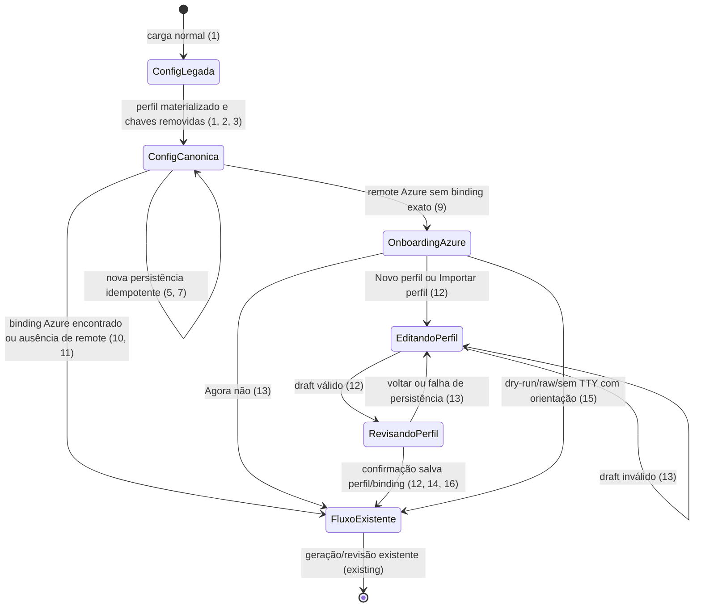
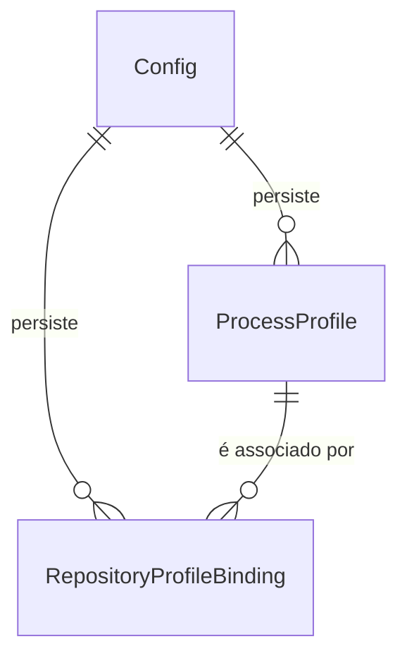

# Migração canônica de perfis e `prt init` global

> Build this with **tlc-implement** (`.agents/skills/tlc-implement/SKILL.md`).
> Every criterion below becomes a check with a proof, referenced by its number. Nothing under
> `Unresolved` gets settled while building.

## Intent

Hoje os mesmos defaults de processo ficam duplicados em `config.json`: uma cópia em
`profiles[Agrotrace]` e outra na raiz (`reviewerDev`, `reviewerSprint`, `testAreaPath`,
`testAssignedTo`, `testProgram` e `testTeam`). O `prt init` ainda edita essa cópia global e pode
reaplicar valores vazios sobre um perfil, enquanto `prt doctor` ainda diagnostica parte desses
campos na raiz. Usuários migrados carregam duas fontes para a mesma decisão e não sabem qual deve
ser editada.

Quando isto estiver disponível, a raiz conterá somente configuração global; os valores de processo
existirão exclusivamente no `ProcessProfile`. A migração removerá as chaves legadas depois de
materializar os dados no perfil `Agrotrace`, `prt init` configurará apenas o ambiente global, e
`prt desc`, `prt test` ou `prt` sem subcomando abrirão o onboarding de perfil para qualquer remote
Azure parseável quando o remote exato ainda não tiver binding.

19 critérios em 4 slices · 7 decisões de mão única · 1 aberta, nenhuma bloqueia

## Criteria

### Migração para a fonte única de perfil

1. Dado um `config.json` legado sem `profiles` com as seis chaves de processo na raiz, quando uma
   carga normal executar a migração, então o arquivo passa a conter exatamente um perfil
   `Agrotrace` com os mesmos valores de `reviewerDev`, `reviewerSprint`, `testAreaPath`,
   `testAssignedTo`, `testProgram` e `testTeam`, `priority: 2`, `inheritIterationPath: true`,
   `parentTransition: "Test QA"` e `defaultProfile: "Agrotrace"`.
2. Dado um `config.json` que já contenha `profiles` e também as seis chaves legadas na raiz,
   quando a normalização for executada, então as seis chaves são removidas, os valores explícitos
   já presentes no perfil são preservados, e `profiles`, `bindings`, `defaultProfile` e as demais
   configurações globais permanecem inalterados.
3. Sempre que `config.json` for persistido depois desta mudança, ele não contém as seis chaves
   legadas na raiz e nenhum `ProcessProfile` contém `azurePat` ou `apiKey`.
4. Dado um arquivo legado que também tenha os overrides antigos de reviewers/Test Case no `.env`,
   quando a migração concluir com sucesso, esses overrides não são mais gravados nem usados como
   fonte para uma configuração que já tenha perfil; `AZURE_PAT` e `PR_AI_API_KEY` continuam sendo
   preservados pelo mecanismo global de segredos.
5. Quando a mesma configuração migrada for carregada e persistida novamente, então continua
   existindo um único perfil `Agrotrace`, nenhuma chave legada reaparece e nenhum binding ou valor
   de perfil é duplicado; se a substituição atômica falhar, o arquivo original permanece intacto.

### `prt init` somente para configuração global

6. Dado `prt init` interativo, então as etapas exibem somente configuração global: PAT do Azure,
   provider, executável/modelo/reasoning dos providers, Base URL/modelo/reasoning/API key do
   endpoint compatível quando aplicável e os defaults/template globais existentes; não exibem
   `reviewerDev`, `reviewerSprint`, `testAreaPath`, `testAssignedTo`, `testProgram`, `testTeam`,
   `profile` ou `parentTransition`.
7. Dada uma configuração com perfis, bindings e `defaultProfile`, quando `prt init` salvar uma
   alteração global, então os perfis e bindings permanecem byte a byte equivalentes, nenhum perfil é
   criado ou editado pelo wizard, `defaultProfile` permanece igual e as seis chaves legadas não são
   escritas.
8. Quando `prt init` for executado sem remote Git ou no modo não interativo, então ele consegue
   salvar somente a configuração global sem criar `Agrotrace`, binding ou qualquer associação de
   repositório.

### Onboarding contextual do remote Azure

9. Dado qualquer remote Azure parseável, sem binding exato para `(organization, project, repository)`
   — organização comparada sem distinção de maiúsculas/minúsculas e projeto/repositório comparados
   exatamente — quando `prt desc`, `prt test` ou `prt` sem subcomando iniciar em TTY, então antes de
   chamar IA ou writer remoto a tela mostra a tupla do remote e oferece `Novo perfil`, `Importar perfil`
   e `Agora não`.
10. Dado o mesmo remote com um único binding exato, quando qualquer um desses comandos iniciar,
    então o onboarding não aparece e o fluxo usa o perfil apontado pelo binding; `prt` sem
    subcomando mantém seu comportamento atual de resolver `desc`.
11. Dado um remote que não seja Azure ou que não possa ser parseado, quando o comando iniciar, então
    o onboarding não aparece, nenhum arquivo é alterado e o fluxo mantém o comportamento existente
    para ausência de remote/fallback (`defaultProfile` ou `Agrotrace`).
12. Quando `Novo perfil` ou `Importar perfil` for escolhido, então a edição e a revisão exibem
    `name`, `programField`, `areaPath`, `assignedTo`, `inheritIterationPath`, `parentTransition`,
    `priority`, `program`, `reviewerDev`, `reviewerSprint` e `team`, exigem confirmação explícita
    e salvam exatamente um perfil e um binding para a tupla atual, sem alterar `defaultProfile`,
    sem recriar as chaves legadas e sem incluir PAT/API key.
13. Dado um draft inválido, cancelamento, recusa de confirmação ou falha de persistência, então o
    `config.json` e o `.env` permanecem sem alteração; `Agora não` continua uma única vez com o
    fallback original e as demais situações exibem erro acionável sem iniciar IA ou writer.
14. Quando o mesmo remote Azure for executado novamente após um salvamento confirmado, então o
    binding existente é reutilizado, nenhum segundo perfil/binding é criado e a tela de onboarding
    não aparece.
15. Dado um remote Azure sem binding em `--dry-run`, `--raw` ou saída sem TTY, então não há pergunta,
    migração gravada ou alteração de arquivo; o comando informa a organização/projeto/repositório e
    orienta executar o fluxo interativo para criar/importar o perfil.
16. Dado um perfil selecionado por binding Azure, quando `prt desc` ou `prt test` avançar para sua
    revisão, então reviewers, settings do Test Case e o `programField` vêm do perfil selecionado,
    e nenhuma das seis chaves removidas da raiz é consultada como fallback.

### Diagnóstico, documentação e prova

17. Quando `prt doctor` validar uma configuração com perfil, então os checks de reviewers, Team,
    programa, prioridade e metadata identificam o remote e o perfil selecionado; ausência de valor
    de processo não gera um aviso falso por raiz vazia nem orienta o usuário a usar `prt init` para
    editar um perfil.
18. A documentação descreve que `prt init` configura apenas valores globais, que perfis são
    cadastrados dinamicamente para remotes Azure sem binding, que a migração remove as seis chaves da
    raiz e que PAT/API key permanecem globais; o exemplo de `config.json` não contém a duplicação.
19. A suíte Rust cobre a migração de configuração sem perfis, a normalização de configuração já
    duplicada, a idempotência/falha atômica, o init sem campos de perfil, a preservação de perfis,
    o onboarding em `prt`, `prt desc` e `prt test`, os modos não interativos e o diagnóstico; então
    `cargo fmt --manifest-path apps/rust/Cargo.toml -- --check`,
    `cargo clippy --manifest-path apps/rust/Cargo.toml --locked --all-targets -- -D clippy::correctness`,
    `cargo test --manifest-path apps/rust/Cargo.toml --locked` e
    `cargo build --manifest-path apps/rust/Cargo.toml --locked --all-targets` passam.

## States

## Out of scope

- onboarding de remotes que não sejam Azure ou não possam ser parseados - o onboarding depende da
  identidade Azure exata do remote
- criação de um novo subcomando ou alteração da semântica de `prt` sem argumentos - ele continua
  sendo o alias atual de `desc`
- edição automática de um perfil já associado mas incompleto - esta task trata ausência de binding;
  validações e edição manual de perfil existente ficam fora
- credenciais por perfil, migração remota no Azure, alteração de Process Template ou descoberta de
  fields fora do `programField` já persistido
- remoção de `defaultProfile`, `profiles` ou `bindings` - essas estruturas continuam sendo a
  configuração canônica local
- mudança no provider, no prompt, na publicação de PR, na criação de Test Case ou no recovery,
  além de trocar a origem dos defaults para o perfil selecionado

## Observable

| Surface | Decision | Landing |
|---|---|---|
| screen `prt init` | empty state | existing - defaults atuais são exibidos quando o campo não tem valor |
| screen `prt init` | loading state | existing - wizard local não consulta Azure |
| screen `prt init` | error state | 7, 8 - validação e falha de persistência mantêm erro acionável sem apagar perfis |
| screen `prt init` | unauthorised state | n/a - PAT é salvo globalmente; o wizard não faz chamada Azure |
| screen `prt init` | density and ordering | 6 |
| screen `prt init` | destructive action confirms | existing - revisão e confirmação explícita de salvamento |
| screen `prt desc / Perfil do repositório` | empty state | 9, 13 |
| screen `prt desc / Perfil do repositório` | loading state | n/a - onboarding só lê Git/configuração local |
| screen `prt desc / Perfil do repositório` | error state | 12, 13, 15 |
| screen `prt desc / Perfil do repositório` | unauthorised state | n/a - a tela não chama Azure |
| screen `prt desc / Perfil do repositório` | density and ordering | 9, 12 |
| screen `prt desc / Perfil do repositório` | destructive action confirms | 12, 13 |
| screen `prt test / Perfil do repositório` | empty state | 9, 13 |
| screen `prt test / Perfil do repositório` | loading state | n/a - onboarding só lê Git/configuração local |
| screen `prt test / Perfil do repositório` | error state | 12, 13, 15 |
| screen `prt test / Perfil do repositório` | unauthorised state | n/a - a tela não chama Azure |
| screen `prt test / Perfil do repositório` | density and ordering | 9, 12 |
| screen `prt test / Perfil do repositório` | destructive action confirms | 12, 13 |
| command `prt` | output, verbosity, flags and exit codes | 9, 10, 13, 15, 16 - normalização atual para `desc` permanece |
| command `prt desc` | output, verbosity, flags and exit codes | 9, 10, 11, 13, 15, 16; comportamento remoto existente permanece |
| command `prt test` | output, verbosity, flags and exit codes | 9, 10, 11, 13, 15, 16; criação/revisão existentes permanecem |
| command `prt init` | output, verbosity and exit codes | 6, 7, 8; erros de validação/persistência permanecem acionáveis |
| command `prt doctor` | output, verbosity and exit codes | 17 |
| document `config.json` | structure, tone, depth and next action | 1, 2, 3, 5, 18 - process values somente em `profiles[]` |
| document `.env` | structure, tone, depth and next action | 4 - segredos globais permanecem; overrides de processo deixam de ser fonte |
| API Azure DevOps | response/error shape, caller, versioning and rate limit | n/a - nenhum endpoint novo ou contrato remoto alterado |
| collection of profiles/bindings | grouping, naming, ordering, duplicates and exception | 1, 2, 5, 12, 14 - perfil e binding únicos por identidade remota |

## Swept

- validation: 1, 2, 6, 12, 16, 17
- failure modes: 5, 7, 8, 13, 15
- idempotency and retry: 5, 14, 16
- authorization: existing - Azure continua usando PAT global no cliente existente; onboarding e init são locais
- concurrency and ordering: 5, 9, 12, 15 - migração/persistência local antecedem IA e writers, e a escrita continua atômica
- data lifecycle: 1, 2, 3, 4, 5 - chaves legadas são migradas uma vez e a fonte canônica passa a ser `profiles[]`
- external-dependency failure: existing - o onboarding não chama Azure; falhas remotas posteriores permanecem no fluxo atual
- state transitions: 9, 12, 13, 14, 15
- observability: 9, 10, 12, 16, 17, 18 - remote, perfil, binding, campo de programa e correção são exibidos sem segredos

## Impact

| Front | What changes |
|---|---|
| domain | existing term `Config` continua carregando configurações globais, mas as seis chaves legadas deixam de ser parte persistida da configuração canônica; leitura transitória só existe para migrar arquivos antigos. Consumidores atuais estão em `config`, `init`, `doctor`, `onboarding`, `process_profiles` e nos fluxos `desc`/`test`. |
| domain | existing term `ProcessProfile` passa a ser a única fonte de `areaPath`, `assignedTo`, `team`, `program`, `reviewerDev`, `reviewerSprint`, `priority`, `inheritIterationPath` e `parentTransition`; seleção e fallback continuam usando `ProfileSelection`. |
| interface | existing `prt init` deixa de ser editor de processo e passa a editar somente PAT/provider/modelos/endpoint/template globais; o onboarding compartilhado de `desc`/`test` passa a ser o ponto de criação do perfil Azure. |
| command | existing `prt doctor` deixa de validar reviewers/Test Case na raiz e passa a reportar o perfil selecionado; `prt` sem subcomando continua encaminhando para `desc`. |
| stored data | `config.json` é normalizado por migração atômica: dados legados são copiados para `profiles[Agrotrace]` e as seis chaves da raiz são removidas; `.env` deixa de ser fonte de defaults de processo, mas mantém PAT/API key globais. |
| documentation | README e mensagens de correção deixam de orientar processo/reviewer para `prt init` e passam a orientar onboarding/perfil/contexto do remote. |

## Decided

| Decision | Shape | Alternative rejected |
|---|---|---|
| fonte única de dados de processo | todos os defaults de Test Case, reviewers e transição ficam no `ProcessProfile`; a raiz guarda somente configuração global | manter a raiz como segunda fonte; rejeitado porque permite divergência e já causou sobrescrita por `prt init` |
| migração de valores conflitantes | se já houver um valor explícito em `profiles[Agrotrace]`, ele vence; chaves legadas só preenchem perfil ausente/incompleto durante a normalização | sobrescrever sempre o perfil com a raiz; rejeitado porque destrói edição nova feita no perfil |
| limpeza persistida | após migração bem-sucedida, remover as seis chaves da raiz e deixar de gravar/usar os overrides equivalentes do `.env` para configurações com perfil | manter campos legados indefinidamente; rejeitado porque preserva a duplicação que a task elimina |
| responsabilidade do `prt init` | `prt init` edita apenas configuração global, preserva perfis/bindings e não precisa de remote Git para salvar | continuar criando/editando `Agrotrace` no wizard; rejeitado porque mistura configuração global com onboarding contextual |
| criação dinâmica | `prt desc`, `prt test` e `prt` sem subcomando usam o onboarding existente quando qualquer remote Azure parseável não possui binding exato; a confirmação continua obrigatória | criar perfil automaticamente no `prt init` ou sem confirmação; rejeitado porque o perfil depende da identidade do remote e de dados de processo |
| escopo do remote | qualquer remote Azure parseável; `organization` compara sem distinção de maiúsculas/minúsculas, enquanto `project` e `repository` exigem igualdade exata na tupla do binding | restringir o onboarding a `ibsbiosistemico`; rejeitado porque `ProcessProfile`/`RepositoryProfileBinding` são genéricos e a recomendação adotada é qualquer remote Azure parseável |
| modos sem interação | `--dry-run`, `--raw` e saída sem TTY não perguntam nem persistem migração/onboarding; informam o remote e orientam a execução interativa | abrir prompt parcial ou salvar automaticamente; rejeitado porque quebra uso script-friendly e o contrato existente de não escrita |

## Relations

- Um `ProcessProfile` pode ser associado a zero ou mais bindings.
- Cada `RepositoryProfileBinding` aponta para exatamente um perfil e uma única identidade
  `(organization, project, repository)`; dois perfis não podem compartilhar essa identidade.
- A migração altera a fonte persistida dos valores, mas não cria uma relação nova nem remove
  `profiles`, `bindings` ou `defaultProfile`.

## Surface

| Route | In | Out | Status | Criteria |
|---|---|---|---|---|
| `prt init` | configuração global existente, PAT/API key e flags atuais | wizard/revisão e configuração global persistida | sucesso, cancelamento e erro existentes; sem perfil/binding | 6, 7, 8, 19 |
| `prt`, `prt desc` | remote Git, `config.json`, flags e estado TTY | onboarding Azure opcional ou fluxo de descrição existente | ausência de remote, binding encontrado e orientação não interativa | 9, 10, 11, 13, 15, 16 |
| `prt test` | remote Git, configuração, Work Item/PR e flags | onboarding Azure opcional ou fluxo de Test Case existente | ausência de remote, binding encontrado e orientação não interativa | 9, 10, 11, 13, 15, 16 |
| `prt doctor` | remote, configuração global e perfil selecionado | checks de perfil/processo e correções acionáveis | perfil válido, incompleto ou binding ausente | 17 |
| `config.json` + `.env` | configuração legada ou canônica | perfil canônico, globals e segredos globais | migração atômica, sem chaves duplicadas | 1, 2, 3, 4, 5 |

## Sources

- Solicitação do usuário nesta conversa - remover a duplicação da raiz, tornar `prt init` global e
  cadastrar dados de processo dinamicamente no contexto do remote
- Resposta do usuário nesta conversa - adotar a recomendação de oferecer onboarding para qualquer
  remote Azure parseável sem binding exato
- [`.tasks/ibs-profile-onboarding.md`](../.tasks/ibs-profile-onboarding.md) - baseline de
  `ProcessProfile`, onboarding, bindings exatos, fallback, modos sem TTY e preservação do fluxo
- [`apps/rust/src/config/mod.rs`](../apps/rust/src/config/mod.rs) - `Config`, campos legados,
  migração, serialização, `profiles`, `bindings` e `defaultProfile`
- [`apps/rust/src/features/init.rs`](../apps/rust/src/features/init.rs) e
  [`apps/rust/src/tui/init_wizard.rs`](../apps/rust/src/tui/init_wizard.rs) - draft, etapas,
  persistência e preservação atual de perfis
- [`apps/rust/src/features/onboarding.rs`](../apps/rust/src/features/onboarding.rs) e
  [`apps/rust/src/tui/profile_onboarding.rs`](../apps/rust/src/tui/profile_onboarding.rs) - decisão,
  edição, confirmação e persistência do onboarding Azure
- [`apps/rust/src/main.rs`](../apps/rust/src/main.rs) e [`apps/rust/src/cli.rs`](../apps/rust/src/cli.rs)
  - dispatch, `prt` como alias de `desc`, modos `dry-run`/`raw` e fronteira do onboarding
- [`apps/rust/src/features/process_profiles.rs`](../apps/rust/src/features/process_profiles.rs),
  [`apps/rust/src/features/doctor.rs`](../apps/rust/src/features/doctor.rs),
  [`apps/rust/src/features/describe.rs`](../apps/rust/src/features/describe.rs) e
  [`apps/rust/src/features/test_card.rs`](../apps/rust/src/features/test_card.rs) - consumidores
  dos valores de perfil e checks atuais
- [`README.md`](../README.md) e [`AGENTS.md`](../AGENTS.md) - documentação pública, comandos de
  validação e convenções do repositório

This task is the record of decision. If a linked document diverges, ask before building.

## Unresolved

| # | Kind | Question | Until answered |
|---|---|---|---|
| 1 | open | Quais campos globais devem ser efetivamente obrigatórios no primeiro `prt init`? | Recomendação: manter a validação atual e os defaults existentes; provider/modelo/reasoning têm defaults, API key/Base URL são condicionais ao provider, e a ausência de PAT só bloqueia operações Azure posteriores. |
